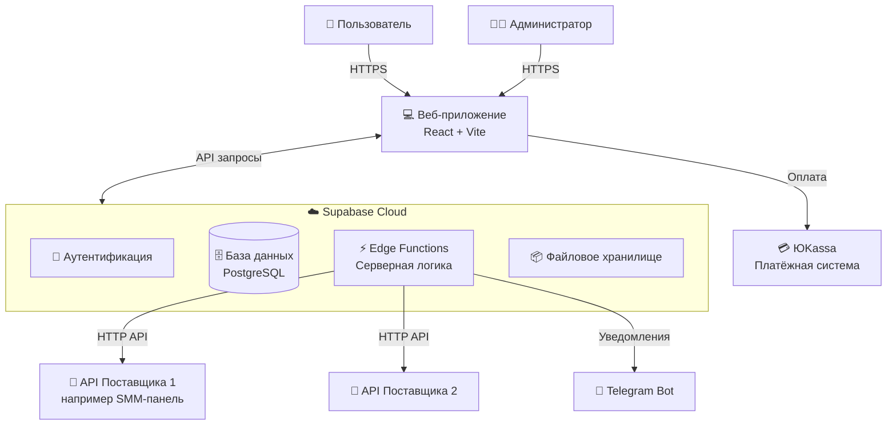
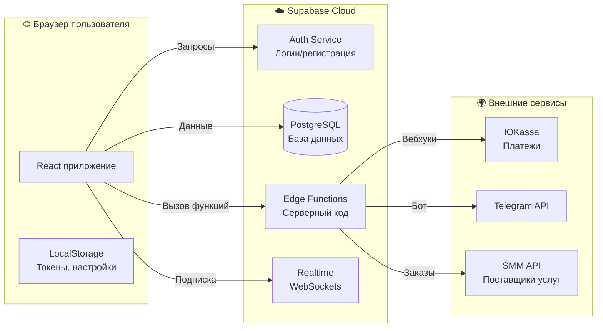
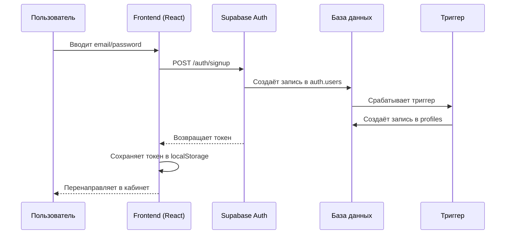
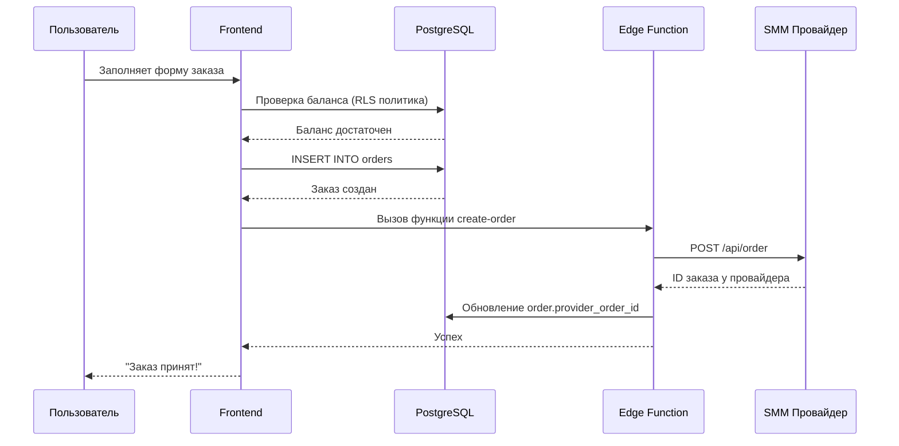
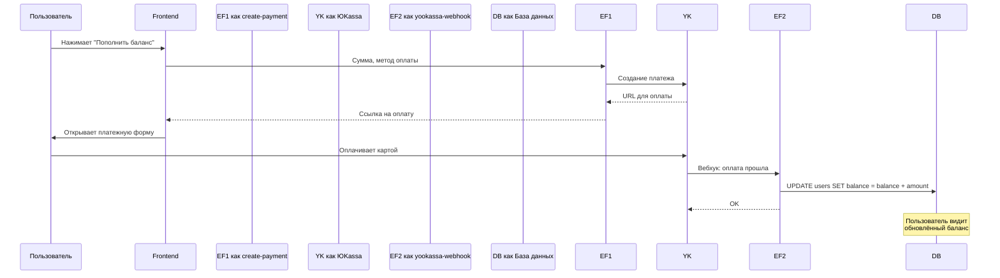

# 🏗️ Архитектура проекта для новичков

> **Простое объяснение сложной системы**  
> Этот документ поможет тебе понять, как устроен проект, даже если ты никогда не работал с подобными системами.

---

## 📖 Оглавление

1. [Что это за проект?](#что-это-за-проект)
2. [Архитектура в картинках](#архитектура-в-картинках)
3. [Как запустить проект](#как-запустить-проект)
4. [Структура файлов](#структура-файлов)
5. [Как данные путешествуют по системе](#как-данные-путешествуют-по-системе)
6. [Основные концепции](#основные-концепции)
7. [Частые вопросы](#частые-вопросы)

---

## Что это за проект?

### 🎯 Назначение

Это **SMM-платформа** (Social Media Marketing) — сервис для накрутки показателей в социальных сетях:
- Лайки, подписчики, просмотры
- Для Instagram, TikTok, Telegram, YouTube и других платформ

**Аналогия из жизни:** Представь интернет-магазин, но вместо товаров люди покупают услуги по продвижению в соцсетях.

### 👥 Кто использует систему?

| Роль | Что делает |
|------|-----------|
| **Клиент** | Заказывает услуги, отслеживает заказы, пополняет баланс |
| **Администратор** | Управляет услугами, пользователями, финансами |
| **Поставщик услуг** | Внешний API, который реально выполняет накрутку |

---

## Архитектура в картинках

### Уровень 1: Общая схема (System Context)



**Простыми словами:**
```
Пользователь → Сайт → Supabase (база + сервер) → Внешние API
```

### Уровень 2: Контейнеры (Container Diagram)



---

## Как запустить проект

### Минимальные требования

```bash
# Проверь что установлено:
node --version      # Нужно v18+
npm --version       # Или bun, pnpm
```

### Шаг 1: Установка зависимостей

```bash
# Вариант A: через npm
npm install

# Вариант B: через bun (быстрее)
bun install
```

**Что происходит:** Скачиваются все библиотеки из `package.json` (~150MB)

### Шаг 2: Настройка переменных окружения

Файл `.env` уже настроен:
```env
VITE_SUPABASE_URL="https://ozgtjafcbwlmpmrsluhy.supabase.co"
VITE_SUPABASE_PUBLISHABLE_KEY="eyJhbGciOiJIUzI1NiIsInR5cCI6IkpXVCJ9..."
```

⚠️ **Важно:** Это публичные ключи только для чтения. Секретные ключи хранятся на сервере Supabase.

### Шаг 3: Запуск разработки

```bash
npm run dev
# или
bun run dev
```

**Что происходит:**
1. Vite запускает локальный сервер на порту 8080
2. Включается "горячая перезагрузка" (изменения видны сразу)
3. Открой http://localhost:8080

### Шаг 4: Сборка для продакшена

```bash
npm run build
```

**Результат:** Папка `dist/` с оптимизированным кодом

---

## Структура файлов

### 📁 Корневая папка

```
/workspace
├── 📄 package.json          # Список всех библиотек
├── 📄 vite.config.ts        # Настройки сборщика
├── 📄 tsconfig.json         # Настройки TypeScript
├── 📄 .env                  # Переменные окружения
├── 📄 index.html            # Точка входа
├── 📁 src/                  # Исходный код приложения
├── 📁 public/               # Статические файлы (иконки, картинки)
├── 📁 supabase/             # Бэкенд логика
│   ├── functions/           # Серверные функции
│   └── migrations/          # Миграции базы данных
└── 📁 node_modules/         # Установленные библиотеки (не трогать!)
```

### 📁 Папка src/ — сердце приложения

```
src/
├── 📄 App.tsx               # Главный компонент, все маршруты
├── 📄 main.tsx              # Точка входа React
├── 
├── 📁 pages/                # Страницы приложения
│   ├── Index.tsx           # Главная страница
│   ├── Auth.tsx            # Вход/регистрация
│   ├── Dashboard.tsx       # Личный кабинет
│   ├── Catalog.tsx         # Каталог услуг
│   ├── Academy.tsx         # Обучающие материалы
│   ├── Contact.tsx         # Контакты
│   │
│   ├── 📁 admin/           # Админ-панель (27 страниц!)
│   │   ├── AdminDashboard.tsx
│   │   ├── AdminUsers.tsx
│   │   ├── AdminOrders.tsx
│   │   ├── AdminServices.tsx
│   │   └── ... (ещё 23 файла)
│   │
│   └── 📁 dashboard/       # Кабинет пользователя (9 страниц)
│       ├── DashboardOverview.tsx
│       ├── DashboardOrders.tsx
│       ├── DashboardProjects.tsx
│       └── ...
│
├── 📁 components/           # Переиспользуемые компоненты
│   ├── 📁 ui/              # UI компоненты от shadcn/ui (49 штук!)
│   │   ├── button.tsx
│   │   ├── dialog.tsx
│   │   ├── table.tsx
│   │   └── ... (ещё 46)
│   │
│   ├── HeroInput.tsx       # Поле ввода на главной
│   ├── CategoryCards.tsx   # Карточки категорий
│   ├── LicenseGate.tsx     # Проверка лицензии
│   ├── TwoFactorGate.tsx   # 2FA проверка
│   └── ...
│
├── 📁 hooks/                # Кастомные React хуки
│   ├── useAuth.ts          # Работа с аутентификацией
│   ├── useAdminRole.ts     # Проверка прав админа
│   ├── useTableControls.ts # Управление таблицами
│   └── ...
│
├── 📁 lib/                  # Вспомогательные функции
│   ├── utils.ts            # Общие утилиты
│   ├── smm-data.ts         # Данные об услугах
│   ├── plan-limits.ts      # Ограничения тарифов
│   └── audit.ts            # Аудит действий
│
└── 📁 integrations/         # Интеграции
    └── 📁 supabase/
        ├── client.ts       # Клиент Supabase
        └── types.ts        # Типы базы данных (автогенерация)
```

### 📁 Supabase функции (серверная логика)

```
supabase/functions/
├── create-payment/         # Создание платежа
├── yookassa-webhook/       # Обработка уведомлений от ЮKassa
├── send-email/             # Отправка email
├── telegram-bot/           # Telegram бот
├── verify-license/         # Проверка лицензии
├── verify-2fa-code/        # Проверка 2FA кода
├── admin-user-management/  # Управление пользователями
├── support-email/          # Техподдержка по email
├── support-telegram-bot/   # Техподдержка в Telegram
└── ... (ещё 9 функций)
```

**Что такое Edge Function?** Это серверный код, который выполняется в облаке Supabase при вызове из фронтенда.

---

## Как данные путешествуют по системе

### Сценарий 1: Регистрация пользователя



**Пошагово:**
1. Пользователь заполняет форму регистрации
2. React отправляет данные в Supabase Auth
3. Supabase создаёт пользователя в таблице `auth.users`
4. Автоматически срабатывает триггер → создаётся запись в `public.profiles`
5. Получаем JWT токен
6. Токен сохраняется в браузере
7. Пользователь видит личный кабинет

### Сценарий 2: Создание заказа



### Сценарий 3: Оплата через ЮKassa



---

## Основные концепции

### 1. Supabase — Backend-as-a-Service

**Что это:** Готовый бэкенд в облаке, не нужно поднимать свой сервер.

**Компоненты:**
| Компонент | Зачем нужен | Аналог |
|-----------|-------------|--------|
| **Auth** | Логин, регистрация, восстановление пароля | Firebase Auth |
| **Database** | Хранение данных (PostgreSQL) | Обычная БД |
| **Edge Functions** | Серверный код на JavaScript | Node.js сервер |
| **Realtime** | Обновления в реальном времени | WebSockets |
| **Storage** | Хранение файлов | AWS S3 |

### 2. RLS (Row Level Security)

**Проблема:** Как защитить данные, если запросы идут напрямую из браузера к БД?

**Решение:** RLS — правила на уровне строк таблицы.

**Пример:**
```sql
-- Пользователь видит ТОЛЬКО свои заказы
CREATE POLICY "Users can view own orders" 
ON orders 
FOR SELECT 
TO authenticated 
USING (auth.uid() = user_id);
```

**Как работает:**
```
❌ Без RLS: SELECT * FROM orders → ВСЕ заказы
✅ С RLS:  SELECT * FROM orders → ТОЛЬКО мои заказы
```

### 3. React Query — управление данными

**Проблема:** Как кэшировать данные, обновлять их, обрабатывать загрузку?

**Решение:** Библиотека `@tanstack/react-query`

**Пример использования:**
```typescript
// Вместо ручного fetch:
const { data, isLoading, error } = useQuery({
  queryKey: ['orders'],
  queryFn: () => supabase.from('orders').select('*')
});
```

**Преимущества:**
- ✅ Автоматическое кэширование
- ✅ Фоновое обновление
- ✅ Retry при ошибках
- ✅ Оптимистичные обновления

### 4. shadcn/ui — библиотека компонентов

**Что это:** Не библиотека в обычном смысле, а коллекция компонентов, которые копируются в проект.

**Преимущества:**
- Полный контроль над кодом
- Можно менять любой компонент
- Нет скрытой магии

**Пример структуры:**
```
components/ui/button.tsx    ← Кнопка
components/ui/dialog.tsx    ← Модальное окно
components/ui/table.tsx     ← Таблица
...
```

### 5. TypeScript — типизация

**Зачем:** Чтобы ловить ошибки до запуска кода.

**Пример:**
```typescript
// ❌ Ошибка будет видна сразу при написании
const order: Order = {
  id: 1,
  // service_name забыли → TypeScript подсветит ошибку
};

// ✅ Автодополнение в редакторе
order. // ← Покажет все доступные поля
```

---

## Ключевые файлы для изучения

### 🎯 Начни отсюда:

| Файл | Что внутри | Почему важен |
|------|-----------|--------------|
| `src/App.tsx` | Все маршруты приложения | Карта всего frontend'а |
| `src/pages/Index.tsx` | Главная страница | Первая страница которую видят пользователи |
| `src/hooks/useAuth.ts` | Логика аутентификации | Как работает вход/выход |
| `supabase/migrations/*.sql` | Структура базы данных | Какие таблицы есть в системе |

### 📊 Для понимания бизнес-логики:

| Файл | Описание |
|------|----------|
| `src/pages/admin/AdminDashboard.tsx` | Админка — дашборд |
| `src/pages/dashboard/DashboardOverview.tsx` | Кабинет пользователя |
| `src/components/LicenseGate.tsx` | Проверка лицензии |
| `supabase/functions/create-payment/index.ts` | Создание платежей |

---

## Частые вопросы

### ❓ Где хранятся пароли пользователей?

**Ответ:** В захешированном виде в Supabase Auth. Пароли никогда не попадают в нашу базу данных.

```
Пароль → bcrypt hash → auth.users (Supabase)
```

### ❓ Как работает авторизация?

**Ответ:** Через JWT токены:

1. Пользователь входит → получает токен
2. Токен сохраняется в `localStorage`
3. Каждый запрос к Supabase включает токен
4. Supabase проверяет токен и возвращает данные

### ❓ Что такое LicenseGate?

**Ответ:** Компонент который проверяет, активна ли лицензия у пользователя, прежде чем показать контент.

```typescript
<LicenseGate>
  <Routes>...</Routes>
</LicenseGate>
```

**Логика:**
- Если лицензия активна → показывает приложение
- Если нет → показывает страницу покупки лицензии

### ❓ Как добавить новую страницу?

**Шаги:**
1. Создать файл в `src/pages/НоваяСтраница.tsx`
2. Добавить маршрут в `src/App.tsx`:
```typescript
<Route path="/new-page" element={<НоваяСтраница />} />
```
3. Создать ссылку в меню

### ❓ Как добавить новую таблицу в БД?

**Шаги:**
1. Создать миграцию в `supabase/migrations/`:
```bash
npx supabase migration new add_users_table
```
2. Написать SQL:
```sql
CREATE TABLE users (...);
ALTER TABLE users ENABLE ROW LEVEL SECURITY;
CREATE POLICY ...;
```
3. Применить миграцию:
```bash
npx supabase db push
```
4. Перегенерировать типы:
```bash
npx supabase gen types typescript > src/integrations/supabase/types.ts
```

### ❓ Где смотреть логи ошибок?

**Варианты:**
1. **Консоль браузера** — ошибки frontend
2. **Supabase Dashboard** → Logs — ошибки backend
3. **Edge Functions logs** — логи серверных функций

---

## Глоссарий терминов

| Термин | Простое объяснение |
|--------|-------------------|
| **Frontend** | То, что видит пользователь в браузере |
| **Backend** | Серверная часть, которая обрабатывает данные |
| **API** | Способ общения между frontend и backend |
| **Database (БД)** | Таблицы с данными (пользователи, заказы и т.д.) |
| **JWT Token** | Цифровой пропуск для доступа к данным |
| **Edge Function** | Функция которая выполняется на сервере |
| **Migration** | SQL скрипт для изменения структуры БД |
| **RLS** | Правила кто может видеть какие строки в таблице |
| **Webhook** | Уведомление от внешнего сервиса (например об оплате) |
| **Component** | Переиспользуемый кусочек UI (кнопка, форма и т.д.) |
| **Hook** | Функция React для общей логики |
| **Route** | URL страница (например /dashboard) |

---

## 🗺️ Карта обучения

### День 1: Знакомство
- [ ] Изучить структуру папок
- [ ] Запустить проект локально
- [ ] Пройтись по всем страницам как пользователь

### День 2: Frontend основы
- [ ] Открыть `src/App.tsx`, понять маршруты
- [ ] Посмотреть как устроены компоненты в `src/components/ui/`
- [ ] Изучить `useAuth.ts` хук

### День 3: База данных
- [ ] Открыть первую миграцию в `supabase/migrations/`
- [ ] Понять какие таблицы есть и как связаны
- [ ] Посмотреть RLS политики

### День 4: Серверная логика
- [ ] Изучить 1-2 Edge Function
- [ ] Понять как работают вебхуки
- [ ] Посмотреть интеграцию с внешними API

### День 5: Практика
- [ ] Добавить простую кнопку на страницу
- [ ] Создать тестовую запись в БД
- [ ] Поэкспериментировать с изменениями

---

## 🔧 Инструменты разработчика

### Расширения для VS Code

| Расширение | Зачем |
|------------|-------|
| ES7+ React/Redux Snippets | Быстрое создание компонентов |
| Tailwind CSS IntelliSense | Подсказки для классов Tailwind |
| Thunder Client | Тестирование API |
| GitLens | История изменений в Git |
| Supabase | Работа с Supabase прямо из редактора |

### Полезные команды

```bash
# Запуск в режиме разработки
npm run dev

# Запуск тестов
npm run test

# Сборка проекта
npm run build

# Проверка типов TypeScript
npx tsc --noEmit

# Линтинг (проверка стиля кода)
npm run lint
```

---

## 📞 Куда обращаться за помощью

1. **Документация React**: https://react.dev
2. **Документация Supabase**: https://supabase.com/docs
3. **Документация Vite**: https://vitejs.dev
4. **shadcn/ui**: https://ui.shadcn.com
5. **Tailwind CSS**: https://tailwindcss.com/docs

---

## 🎉 Заключение

Этот проект — современное fullstack приложение с:
- ✅ React + TypeScript на frontend
- ✅ Supabase (PostgreSQL + Auth + Functions) на backend
- ✅ Готовой админ-панелью и личным кабинетом
- ✅ Интеграцией с платёжными системами
- ✅ Системой лицензий и 2FA

**Главное преимущество архитектуры:** Минимум инфраструктуры — всё работает в облаке Supabase.

**Следующие шаги:** 
1. Запусти проект локально
2. Изучи `src/App.tsx` — это карта всего приложения
3. Экспериментируй с изменениями!

---

*Документ создан для帮助 новичкам быстро влиться в проект.*  
*Последнее обновление: Март 2026*
