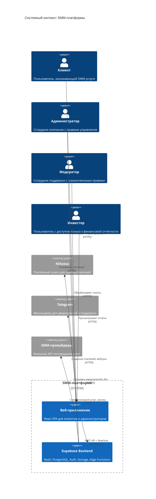
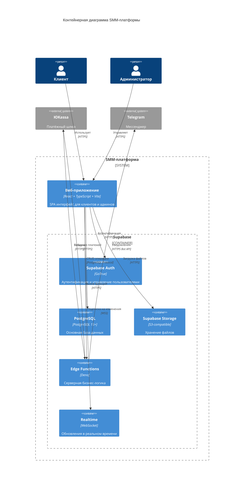
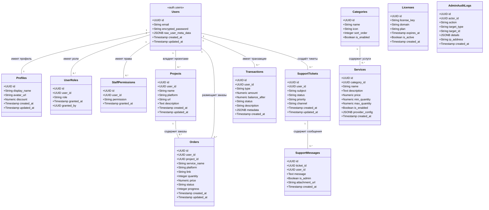
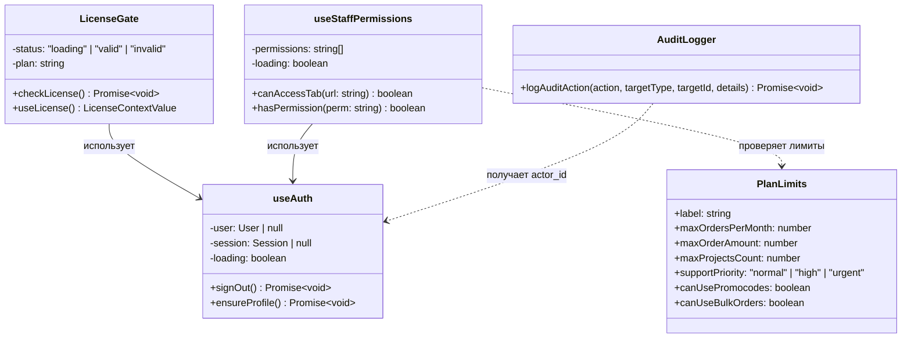
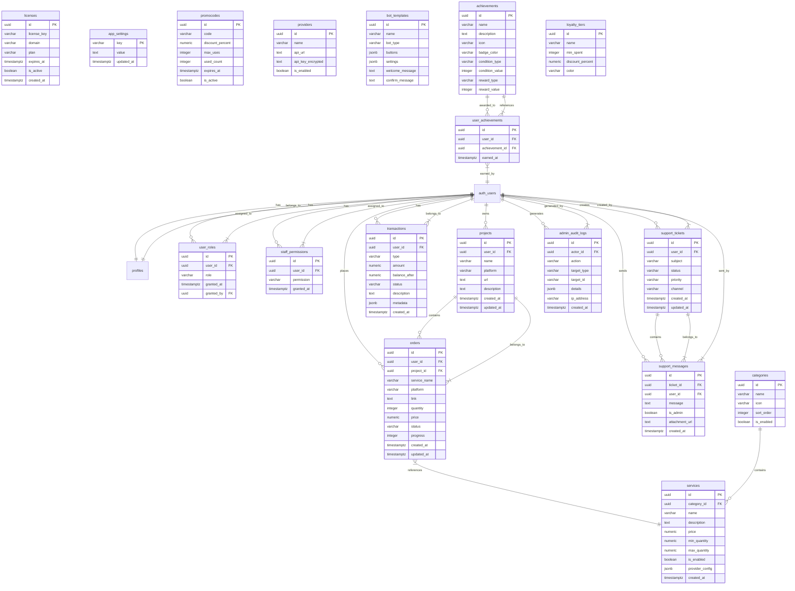
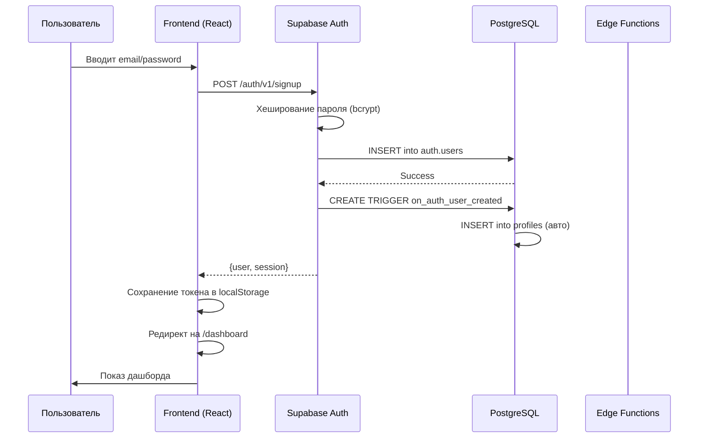
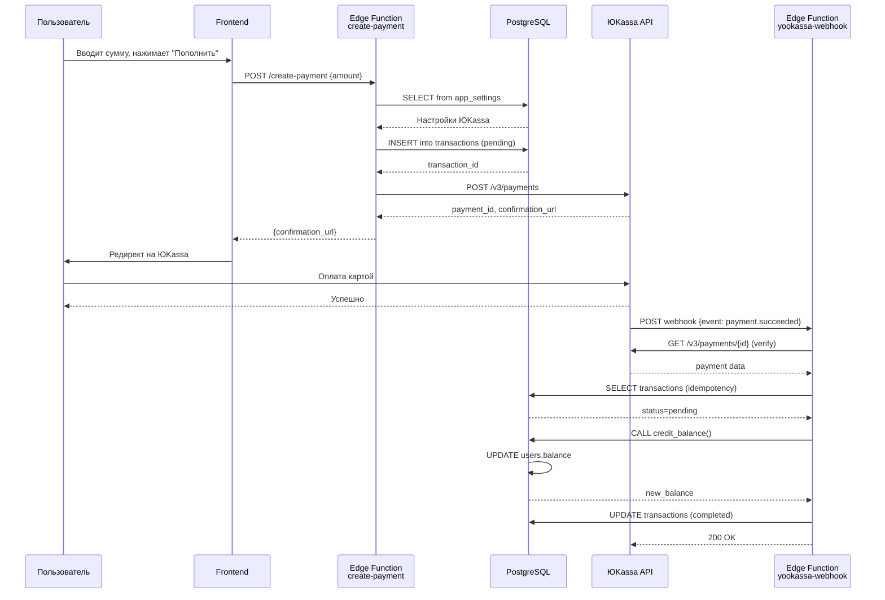
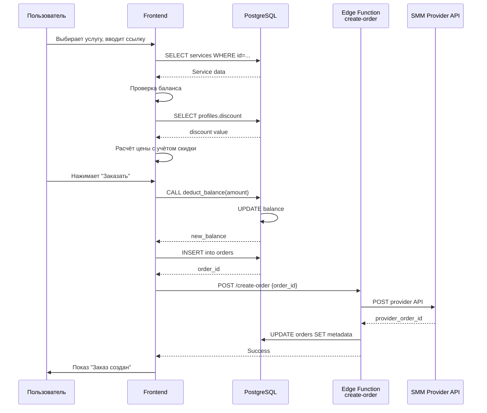
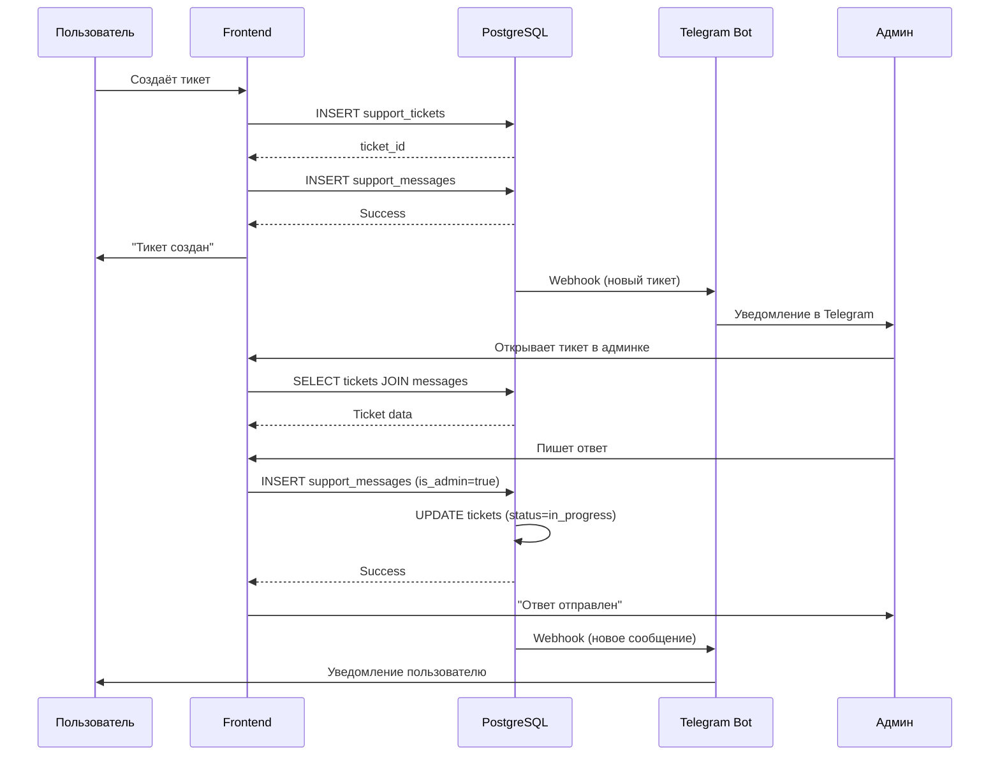
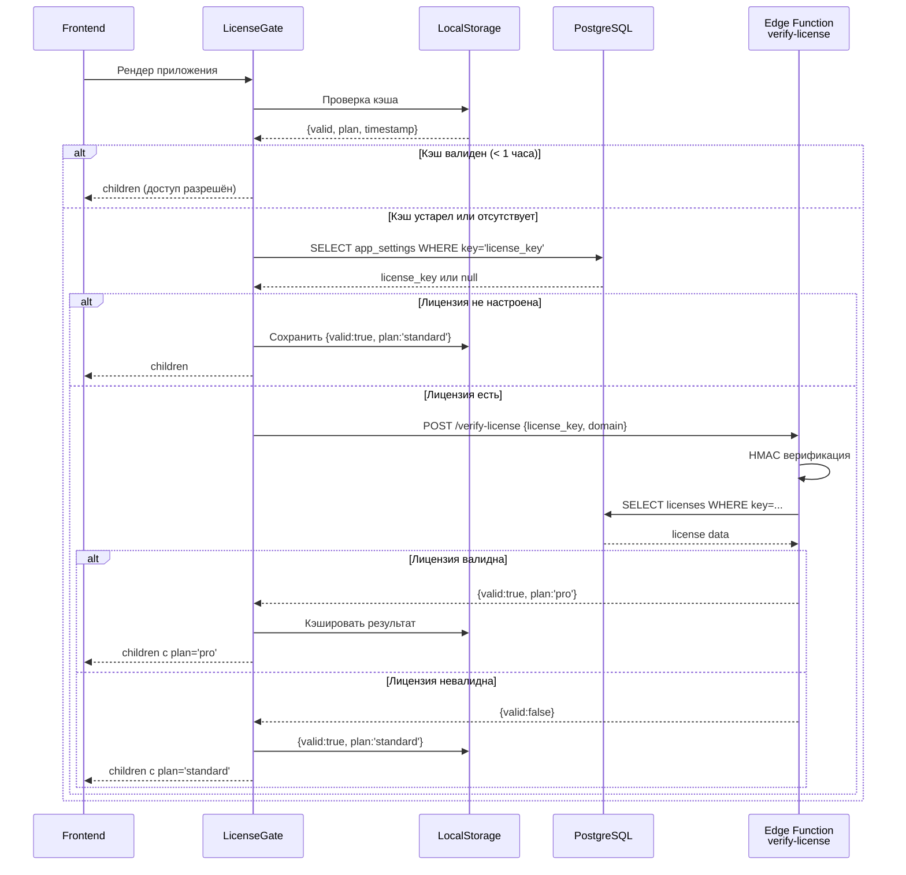

# Техническая документация SMM-платформы

**Версия документа:** 1.0  
**Дата создания:** Март 2026  
**Статус:** Актуальная  

---

# 1. ОБЩЕЕ ОПИСАНИЕ СИСТЕМЫ

## 1.1 Назначение проекта

### Что делает система

Данная система представляет собой **полнофункциональную SMM-панель (Social Media Marketing)** — платформу для автоматизации продвижения в социальных сетях. Система позволяет пользователям заказывать услуги по накрутке показателей (подписчики, лайки, просмотры, комментарии) для различных социальных платформ.

### Какую бизнес-проблему решает

1. **Автоматизация SMM-услуг**: Централизованная платформа для заказа и управления продвижением в соцсетях
2. **Масштабируемость**: Возможность обслуживания тысяч пользователей одновременно
3. **Монетизация**: Встроенная платёжная система с поддержкой ЮKassa
4. **Управление клиентами**: Полноценная CRM-система для работы с пользователями
5. **Поддержка**: Интегрированная система тикетов с поддержкой Telegram
6. **Лицензирование**: Защита продукта через систему лицензионных ключей

### Целевая аудитория

| Сегмент | Описание | Потребности |
|---------|----------|-------------|
| **SMM-специалисты** | Профессионалы, занимающиеся продвижением | Массовые заказы, API доступ, оптовые цены |
| **Владельцы бизнеса** | Предприниматели, продвигающие свои проекты | Простота использования, прозрачная отчётность |
| **Блогеры/Инфлюенсеры** | Создатели контента | Быстрое увеличение показателей, гарантия качества |
| **Агентства** | Маркетинговые агентства | Мультипроектное управление, белые метки |
| **Перепродавцы** | Резеллеры SMM-услуг | API для интеграции, гибкое ценообразование |

---

## 1.2 Технологический стек

### Frontend

| Категория | Технология | Версия | Зачем используется | Альтернативы |
|-----------|------------|--------|-------------------|--------------|
| **Фреймворк** | React | 18.3.1 | Основной UI-фреймворк для построения интерфейса | Vue.js, Angular, Svelte |
| **Сборщик** | Vite | 5.4.19 | Быстрая сборка и hot-reload при разработке | Webpack, Parcel, esbuild |
| **Язык** | TypeScript | 5.8.3 | Типизация JavaScript кода для безопасности | JavaScript, Flow |
| **Роутинг** | React Router | 6.30.1 | Навигация между страницами SPA | Reach Router, Wouter |
| **UI-компоненты** | shadcn/ui (Radix UI) | различные | Готовые доступные компоненты интерфейса | Material-UI, Ant Design, Chakra UI |
| **Стилизация** | Tailwind CSS | 3.4.17 | Утилитарные CSS-классы для стилизации | Bootstrap, Bulma, Styled Components |
| **Анимации** | Framer Motion | 12.35.1 | Плавные анимации и переходы | GSAP, React Spring, Anime.js |
| **Графики** | Recharts | 2.15.4 | Визуализация данных в админке и дашборде | Chart.js, Victory, Nivo |
| **Формы** | React Hook Form | 7.61.1 | Управление формами с валидацией | Formik, Final Form |
| **Валидация** | Zod | 3.25.76 | Схема валидации данных | Yup, Joi, io-ts |
| **HTTP-клиент** | @supabase/supabase-js | 2.98.0 | Клиент для взаимодействия с Supabase | Axios, fetch, React Query |
| **State Management** | React Query (TanStack) | 5.83.0 | Кэширование и синхронизация серверного состояния | SWR, Redux Toolkit, Zustand |
| **Иконки** | Lucide React | 0.462.0 | Набор SVG-иконок | Heroicons, Feather Icons, FontAwesome |

### Backend (Supabase)

| Категория | Технология | Версия | Зачем используется | Альтернативы |
|-----------|------------|--------|-------------------|--------------|
| **BaaS-платформа** | Supabase | latest | Backend-as-a-Service: БД, аутентификация, хранилище | Firebase, AWS Amplify, Appwrite |
| **База данных** | PostgreSQL | 15+ | Реляционная СУБД для хранения всех данных | MySQL, MariaDB, MongoDB |
| **Edge Functions** | Deno | latest | Серверные функции на JavaScript/TypeScript | AWS Lambda, Cloudflare Workers, Node.js |
| **Realtime** | Supabase Realtime | latest | WebSocket-соединения для обновлений в реальном времени | Socket.io, Pusher, Ably |
| **Storage** | Supabase Storage | latest | Хранение файлов (аватарки, вложения) | AWS S3, Cloudinary, Firebase Storage |
| **Auth** | Supabase Auth | latest | Аутентификация пользователей (email, OAuth) | Auth0, Clerk, Okta |

### Инфраструктура и DevOps

| Категория | Технология | Версия | Зачем используется | Альтернативы |
|-----------|------------|--------|-------------------|--------------|
| **Хостинг фронтенда** | Lovable / Vercel | - | Размещённое веб-приложение | Netlify, Cloudflare Pages, AWS S3+CloudFront |
| **Платёжный шлюз** | ЮKassa | API v3 | Приём платежей (карты, СБП, электронные кошельки) | Stripe, CloudPayments, Tinkoff Kassa |
| **Telegram Bot API** | Telegram Bot API | latest | Уведомления и поддержка через Telegram | WhatsApp Business API, Slack API |
| **Email** | SMTP / Supabase Email | - | Отправка транзакционных писем | SendGrid, Mailgun, Amazon SES |

### Инструменты разработки

| Категория | Технология | Версия | Зачем используется | Альтернативы |
|-----------|------------|--------|-------------------|--------------|
| **Линтер** | ESLint | 9.32.0 | Статический анализ кода | JSHint, JSLint |
| **Тестирование** | Vitest | 3.2.4 | Unit-тесты для frontend | Jest, Mocha, Ava |
| **Testing Library** | @testing-library/react | 16.0.0 | Тестирование компонентов React | Enzyme, React Testing Utils |
| **PostCSS** | PostCSS | 8.5.6 | Обработка CSS (автопрефиксы) | Less, Sass |
| **Autoprefixer** | autoprefixer | 10.4.21 | Автоматическое добавление vendor-префиксов | - |

---

## 1.3 Ключевые возможности

### Для пользователей (клиентов)

1. **Каталог услуг**
   - Просмотр доступных SMM-услуг по категориям
   - Фильтрация по платформам (Instagram, TikTok, YouTube, VK, Telegram)
   - Детальная информация об услугах (цена, описание, требования)

2. **Заказ услуг**
   - Оформление заказа с указанием ссылки и количества
   - Массовые заказы (bulk orders)
   - Отслеживание статуса выполнения

3. **Управление проектами**
   - Создание проектов для группировки заказов
   - Привязка заказов к конкретным проектам
   - История активности по проектам

4. **Финансы**
   - Пополнение баланса через ЮKassa
   - История транзакций
   - Промокоды и скидки

5. **Профиль пользователя**
   - Настройки аккаунта
   - Двухфакторная аутентификация (2FA)
   - Персональные скидки

6. **Поддержка**
   - Система тикетов
   - Чат с поддержкой
   - База знаний (FAQ)
   - Поддержка через Telegram

7. **Программа лояльности**
   - Уровни лояльности (tiers)
   - Достижения и бейджи
   - Колесо фортуны (бонусы)

### Для администраторов

1. **Дашборд**
   - Ключевые метрики в реальном времени
   - Графики и аналитика
   - Последние действия

2. **Управление заказами**
   - Просмотр всех заказов
   - Изменение статусов
   - Возвраты средств (refunds)
   - Отмена заказов

3. **Управление пользователями**
   - Список всех пользователей
   - Детальная информация о пользователе
   - Редактирование профиля
   - Блокировка/разблокировка
   - Управление балансом

4. **Управление услугами**
   - CRUD операций для услуг
   - Категоризация
   - Наценка (markup)
   - Синхронизация с провайдерами

5. **Финансовый учёт**
   - История транзакций
   - Расходы бизнеса
   - Отчётность P&L (Profit & Loss)
   - Курсы валют

6. **Контент-менеджмент**
   - Управление статическими страницами
   - FAQ статьи
   - Виджеты сайта
   - Баннеры и акции

7. **Сотрудники и роли**
   - Управление персоналом
   - Настройка прав доступа (permissions)
   - Роли: admin, ceo, moderator, investor
   - Аудит действий сотрудников

8. **Настройки системы**
   - Платёжные настройки (ЮKassa)
   - Лицензионные ключи
   - API ключи
   - Общие настройки приложения

9. **Поддержка**
   - Управление тикетами
   - Шаблоны ответов
   - Запросы (inquiries)
   - AI-предложения ответов

10. **Telegram-боты**
    - Конструктор ботов
    - Шаблоны ботов
    - Настройка кнопок и действий

---

# 2. C4 ДИАГРАММЫ

## Level 1 — System Context



### Детальное описание

#### Пользователи системы

| Актор | Описание | Основные действия |
|-------|----------|------------------|
| **Клиент** | Зарегистрированный пользователь | Регистрация, заказ услуг, пополнение баланса, создание тикетов |
| **Администратор** | Полный доступ к системе | Управление всеми сущностями, настройка системы, финансы |
| **Модератор** | Ограниченный доступ | Обработка тикетов, управление заказами (без финансов) |
| **Инвестор** | Только просмотр финансов | Просмотр аналитики, отчётов о доходах/расходах |

#### Внешние системы

| Система | Назначение | Протокол | Данные |
|---------|------------|----------|--------|
| **ЮKassa** | Приём платежей | HTTPS REST API | Создание платежей, вебхуки о статусе |
| **Telegram** | Уведомления и поддержка | HTTPS Bot API | Сообщения пользователям, уведомления админам |
| **SMM-провайдеры** | Исполнение заказов | HTTPS API | Каталог услуг, создание заказов, статусы |

---

## Level 2 — Container Diagram



### Детальное описание контейнеров

#### 1. Веб-приложение (web_app)

| Параметр | Значение |
|----------|----------|
| **Технология** | React 18.3 + TypeScript + Vite 5.4 |
| **Назначение** | Единственный интерфейс для всех пользователей системы |
| **Порты** | 8080 (dev), 443 (prod через CDN) |
| **Протокол** | HTTPS |

**Что делает:**
- Отображает пользовательский интерфейс
- Обрабатывает ввод данных и валидацию на клиенте
- Отправляет запросы к Supabase
- Управляет состоянием приложения (React Query)
- Маршрутизация между страницами (React Router)

**Взаимодействие:**
- → Auth: вход/регистрация, refresh токенов
- → Database: чтение/запись данных через Supabase клиент
- → Storage: загрузка аватарок, вложений
- → Edge Functions: вызов серверной логики (платежи, лицензии)
- ← Realtime: получение обновлений в реальном времени

#### 2. Supabase Auth (auth)

| Параметр | Значение |
|----------|----------|
| **Технология** | GoTrue (Open Source) |
| **Назначение** | Управление аутентификацией пользователей |
| **Протокол** | HTTPS REST API |

**Что делает:**
- Регистрация новых пользователей (email + пароль)
- Вход через email/password
- OAuth провайдеры (Google, GitHub и др.)
- Восстановление пароля
- Двухфакторная аутентификация (TOTP)
- Выдача JWT токенов (access + refresh)

**Таблицы:**
- `auth.users` — основные данные пользователей
- `auth.identities` — связанные OAuth аккаунты
- `auth.sessions` — активные сессии

#### 3. PostgreSQL (database)

| Параметр | Значение |
|----------|----------|
| **Технология** | PostgreSQL 15+ |
| **Назначение** | Основное хранилище всех данных |
| **Протокол** | PostgreSQL Wire Protocol (порт 5432) |

**Что хранит:**
- Профили пользователей
- Проекты и заказы
- Транзакции и баланс
- Услуги и категории
- Тикеты поддержки
- Настройки системы
- Логи аудита

**Особенности:**
- Row Level Security (RLS) для защиты данных
- Триггеры для автоматических действий
- Функции для бизнес-логики
- Индексы для производительности

#### 4. Supabase Storage (storage)

| Параметр | Значение |
|----------|----------|
| **Технология** | S3-compatible object storage |
| **Назначение** | Хранение пользовательских файлов |
| **Протокол** | HTTPS REST API |

**Что хранит:**
- Аватарки пользователей
- Вложения в тикетах поддержки
- Изображения для контента

#### 5. Edge Functions (edge_fn)

| Параметр | Значение |
|----------|----------|
| **Технология** | Deno (JavaScript/TypeScript runtime) |
| **Назначение** | Серверная бизнес-логика |
| **Протокол** | HTTPS REST API |

**Функции:**
- `create-payment` — создание платежа в ЮKassa
- `yookassa-webhook` — обработка вебхуков от платёжки
- `verify-license` — проверка лицензионных ключей
- `send-email` — отправка email уведомлений
- `telegram-bot` — интеграция с Telegram
- `support-email` — обработка входящих email
- `admin-user-management` — управление пользователями
- `delete-account` — удаление аккаунта
- `process-refund` — возврат средств
- И другие...

#### 6. Realtime

| Параметр | Значение |
|----------|----------|
| **Технология** | WebSocket (Supabase Realtime) |
| **Назначение** | Обновления данных в реальном времени |
| **Протокол** | WSS (WebSocket Secure) |

**Что отслеживает:**
- Изменения статусов заказов
- Новые сообщения в тикетах
- Обновления баланса
- Уведомления

---

## Level 3 — Component Diagram

### Frontend — Компоненты

```mermaid
C4Component
  title Компоненты веб-приложения

  Container_Boundary(web_app, "Веб-приложение (React)") {
    Component(router, "Router", "React Router", "Маршрутизация между страницами")
    Component(auth_provider, "Auth Provider", "Context + Hooks", "Состояние аутентификации")
    Component(license_gate, "License Gate", "HOC", "Проверка лицензии приложения")
    
    Component_Boundary(pages_public, "Публичные страницы") {
      Component(index, "Index", "Page", "Главная страница")
      Component(catalog, "Catalog", "Page", "Каталог услуг")
      Component(academy, "Academy", "Page", "Обучающие материалы")
      Component(glossary, "Glossary", "Page", "Глоссарий терминов")
      Component(contact, "Contact", "Page", "Контакты")
      Component(auth_page, "Auth", "Page", "Вход/Регистрация")
    }
    
    Component_Boundary(pages_dashboard, "Дашборд пользователя") {
      Component(dashboard_overview, "Overview", "Page", "Обзор проектов")
      Component(dashboard_orders, "Orders", "Page", "Мои заказы")
      Component(dashboard_projects, "Projects", "Page", "Управление проектами")
      Component(dashboard_transactions, "Transactions", "Page", "История платежей")
      Component(dashboard_support, "Support", "Page", "Тикеты поддержки")
      Component(dashboard_settings, "Settings", "Page", "Настройки профиля")
      Component(dashboard_bonuses, "Bonuses", "Page", "Бонусы и достижения")
    }
    
    Component_Boundary(pages_admin, "Админ-панель") {
      Component(admin_dashboard, "Admin Dashboard", "Page", "Общая статистика")
      Component(admin_orders, "Orders Manager", "Page", "Управление заказами")
      Component(admin_users, "Users Manager", "Page", "Управление пользователями")
      Component(admin_services, "Services Manager", "Page", "Каталог услуг")
      Component(admin_analytics, "Analytics", "Page", "Аналитика и отчёты")
      Component(admin_support, "Support Manager", "Page", "Тикеты поддержки")
      Component(admin_staff, "Staff Manager", "Page", "Сотрудники и права")
      Component(admin_payments, "Payments", "Page", "Платежи и настройки")
      Component(admin_content, "Content Manager", "Page", "Страницы, FAQ, виджеты")
    }
    
    Component_Boundary(components_shared, "Общие компоненты") {
      Component(ui_lib, "UI Library", "shadcn/ui", "50+ переиспользуемых компонентов")
      Component(contact_form, "Guest Contact Form", "Component", "Форма для гостей")
      Component(license_gate_comp, "LicenseGate", "Component", "Проверка лицензии")
      Component(two_factor_gate, "TwoFactorGate", "Component", "2FA проверка")
      Component(cookie_consent, "CookieConsent", "Component", "Согласие на cookies")
    }
    
    Component_Boundary(hooks, "Custom Hooks") {
      Component(use_auth, "useAuth", "Hook", "Состояние аутентификации")
      Component(use_license, "useLicense", "Hook", "Данные лицензии")
      Component(use_permissions, "useStaffPermissions", "Hook", "Права сотрудника")
      Component(use_table, "useTableControls", "Hook", "Управление таблицами")
    }
    
    Component_Boundary(libs, "Библиотеки") {
      Component(plan_limits, "Plan Limits", "Module", "Ограничения тарифов")
      Component(audit, "Audit Logger", "Module", "Логирование действий")
      Component(smm_data, "SMM Data", "Module", "Данные об услугах")
    }
  }

  Rel(router, index, "Маршрутизирует")
  Rel(router, dashboard_overview, "Маршрутизирует")
  Rel(router, admin_dashboard, "Маршрутизирует")
  Rel(auth_provider, use_auth, "Предоставляет")
  Rel(license_gate, use_license, "Предоставляет")
  Rel(dashboard_orders, ui_lib, "Использует")
  Rel(admin_users, use_permissions, "Использует")
```

### Backend Edge Functions — Компоненты

```mermaid
C4Component
  title Компоненты Edge Functions

  Container_Boundary(edge_fn, "Edge Functions (Deno)") {
    Component_Boundary(payment_fns, "Платёжные функции") {
      Component(create_payment, "create-payment", "Function", "Создание платежа в ЮKassa")
      Component(yookassa_webhook, "yookassa-webhook", "Function", "Обработка вебхуков")
      Component(process_refund, "process-refund", "Function", "Возврат средств")
    }
    
    Component_Boundary(auth_fns, "Аутентификация") {
      Component(send_2fa, "send-2fa-code", "Function", "Отправка 2FA кода")
      Component(verify_2fa, "verify-2fa-code", "Function", "Проверка 2FA кода")
      Component(delete_account, "delete-account", "Function", "Удаление аккаунта")
    }
    
    Component_Boundary(license_fns, "Лицензирование") {
      Component(verify_license, "verify-license", "Function", "Проверка лицензионного ключа")
    }
    
    Component_Boundary(support_fns, "Поддержка") {
      Component(support_email, "support-email", "Function", "Обработка email тикетов")
      Component(support_telegram, "support-telegram-bot", "Function", "Telegram бот поддержки")
      Component(support_ai, "support-ai-suggest", "Function", "AI предложения ответов")
      Component(auto_close, "auto-close-tickets", "Function", "Автозакрытие тикетов")
    }
    
    Component_Boundary(bot_fns, "Telegram боты") {
      Component(telegram_bot, "telegram-bot", "Function", "Основной Telegram бот")
    }
    
    Component_Boundary(admin_fns, "Администрирование") {
      Component(admin_user_mgmt, "admin-user-management", "Function", "Управление пользователями")
      Component(mcp_admin, "mcp-admin", "Function", "MCP протокол для админки")
    }
    
    Component_Boundary(sync_fns, "Синхронизация") {
      Component(sync_services, "sync-services", "Function", "Синхронизация с провайдерами")
      Component(fetch_rates, "fetch-exchange-rates", "Function", "Курсы валют")
    }
    
    Component_Boundary(order_fns, "Заказы") {
      Component(create_order, "create-order", "Function", "Создание заказа")
    }
    
    Component_Boundary(proxy_fns, "Прокси") {
      Component(vexboost_proxy, "vexboost-proxy", "Function", "Прокси для vexboost API")
    }
    
    Component_Boundary(email_fns, "Email") {
      Component(send_email, "send-email", "Function", "Отправка email уведомлений")
    }
  }

  Rel(create_payment, yookassa_webhook, "Создаёт транзакцию")
  Rel(yookassa_webhook, process_refund, "Может инициировать возврат")
  Rel(telegram_bot, support_telegram, "Интеграция")
  Rel(admin_user_mgmt, delete_account, "Вызывает")
```

---

## Level 4 — Code (UML классы)

### Основные модели данных



### Ключевые классы frontend



---

# 3. DOCKER-КОНТЕЙНЕРЫ

**Примечание:** Данный проект использует **Supabase Cloud** как BaaS (Backend-as-a-Service), поэтому локально не требует развёртывания Docker-контейнеров для базы данных, аутентификации и других сервисов. 

Однако, для локальной разработки с Supabase CLI возможно использование следующих контейнеров:

## 3.1 PostgreSQL (через Supabase Local)

| Параметр | Значение |
|----------|----------|
| **Имя контейнера** | supabase_db_[project_id] |
| **Образ** | supabase/postgres:15.x |
| **Назначение** | Локальная копия продакшен БД для разработки |
| **Порты** | 54322:5432 |
| **Volumes** | postgres_data:/var/lib/postgresql/data |

**Зачем:**
- Локальная разработка с полной копией схемы БД
- Тестирование миграций перед деплоем
- Отладка RLS политик

## 3.2 Supabase Studio

| Параметр | Значение |
|----------|----------|
| **Имя контейнера** | supabase_studio_[project_id] |
| **Образ** | supabase/studio:latest |
| **Назначение** | Веб-интерфейс для управления БД (аналог phpMyAdmin) |
| **Порты** | 54323:3000 |

**Зачем:**
- Визуальный просмотр таблиц
- Редактирование данных
- Выполнение SQL-запросов

## 3.3 Kong API Gateway (Supabase)

| Параметр | Значение |
|----------|----------|
| **Имя контейнера** | supabase_kong_[project_id] |
| **Образ** | kong:2.8 |
| **Назначение** | API Gateway для маршрутизации запросов |
| **Порты** | 54321:8000 |

**Зачем:**
- Маршрутизация запросов к разным сервисам Supabase
- Аутентификация JWT
- Rate limiting

---

# 4. СХЕМА БАЗЫ ДАННЫХ (ДЕТАЛЬНО)

## 4.1 ER-диаграмма



## 4.2 Описание КАЖДОЙ таблицы

### Таблица: auth.users (Supabase Auth)

| Поле | Тип | Ограничения | Индекс | Описание |
|------|-----|-------------|--------|----------|
| id | UUID | PRIMARY KEY | YES | Уникальный идентификатор пользователя |
| email | VARCHAR(255) | UNIQUE, NOT NULL | YES | Email адрес (логин) |
| encrypted_password | VARCHAR(255) | NOT NULL | - | Хешированный пароль (bcrypt) |
| email_confirmed_at | TIMESTAMPTZ | - | - | Дата подтверждения email |
| raw_user_meta_data | JSONB | - | - | Дополнительные данные (display_name, avatar) |
| created_at | TIMESTAMPTZ | NOT NULL DEFAULT now() | YES | Дата регистрации |
| updated_at | TIMESTAMPTZ | NOT NULL DEFAULT now() | - | Дата последнего обновления |
| last_sign_in_at | TIMESTAMPTZ | - | - | Дата последнего входа |
| role | VARCHAR(255) | DEFAULT 'authenticated' | - | Роль в системе auth |

**Назначение:** Основная таблица аутентификации. Управляется Supabase Auth автоматически.

**Бизнес-правила:**
- Email должен быть уникальным
- Пароль хешируется алгоритмом bcrypt (стоимость 10)
- После регистрации отправляется email для подтверждения

---

### Таблица: profiles

| Поле | Тип | Ограничения | Индекс | Описание |
|------|-----|-------------|--------|----------|
| id | UUID | PRIMARY KEY, FK → auth.users | YES | Ссылка на пользователя |
| display_name | TEXT | - | - | Отображаемое имя |
| avatar_url | TEXT | - | - | URL аватарки в Storage |
| discount | NUMERIC | DEFAULT 0, NOT NULL | - | Персональная скидка (0-100%) |
| created_at | TIMESTAMPTZ | DEFAULT now() | YES | Дата создания |
| updated_at | TIMESTAMPTZ | DEFAULT now() | - | Дата обновления |

**Назначение:** Расширенная информация о пользователе, не относящаяся к аутентификации.

**Связи:**
- Один к одному с auth.users (ON DELETE CASCADE)

**Бизнес-правила:**
- Создаётся автоматически триггером при регистрации
- discount по умолчанию 0 (нет скидки)
- display_name берётся из email если не указан

**Триггеры:**
```sql
CREATE TRIGGER on_auth_user_created
  AFTER INSERT ON auth.users
  FOR EACH ROW EXECUTE FUNCTION handle_new_user();
```

---

### Таблица: user_roles

| Поле | Тип | Ограничения | Индекс | Описание |
|------|-----|-------------|--------|----------|
| id | UUID | PRIMARY KEY | YES | Уникальный ID записи |
| user_id | UUID | FK → auth.users, NOT NULL | YES | Пользователь |
| role | VARCHAR(50) | NOT NULL, CHECK IN (...) | YES | Роль: admin, ceo, moderator, investor |
| granted_at | TIMESTAMPTZ | DEFAULT now() | - | Дата выдачи роли |
| granted_by | UUID | FK → auth.users | - | Кто выдал роль |

**Назначение:** Система ролевого доступа (RBAC).

**Возможные роли:**
- `admin` — полный доступ
- `ceo` — высший уровень, полный доступ
- `moderator` — ограниченный доступ (настраивается permissions)
- `investor` — только просмотр финансов

**Бизнес-правила:**
- Один пользователь может иметь несколько ролей
- Только admin/ceo могут назначать роли

---

### Таблица: staff_permissions

| Поле | Тип | Ограничения | Индекс | Описание |
|------|-----|-------------|--------|----------|
| id | UUID | PRIMARY KEY | YES | Уникальный ID |
| user_id | UUID | FK → auth.users, NOT NULL | YES | Сотрудник |
| permission | VARCHAR(50) | NOT NULL | YES | Право доступа |
| granted_at | TIMESTAMPTZ | DEFAULT now() | - | Дата выдачи |

**Назначение:** Детальные права доступа для сотрудников (moderator).

**Возможные permissions:**
- `manage_orders` — управление заказами
- `manage_users` — управление пользователями
- `manage_services` — управление услугами
- `manage_support` — техподдержка
- `manage_content` — контент
- `process_refunds` — возвраты
- `manage_staff` — сотрудники
- `view_audit_logs` — логи
- `view_finances` — финансы

---

### Таблица: projects

| Поле | Тип | Ограничения | Индекс | Описание |
|------|-----|-------------|--------|----------|
| id | UUID | PRIMARY KEY | YES | ID проекта |
| user_id | UUID | FK → auth.users, NOT NULL | YES | Владелец |
| name | TEXT | NOT NULL | - | Название проекта |
| platform | TEXT | - | INDEX | Платформа (instagram, tiktok...) |
| url | TEXT | - | - | Ссылка на проект |
| description | TEXT | - | - | Описание |
| created_at | TIMESTAMPTZ | DEFAULT now() | YES | Дата создания |
| updated_at | TIMESTAMPTZ | DEFAULT now() | - | Дата обновления |

**Назначение:** Группировка заказов по проектам (например, разные Instagram-аккаунты).

**Связи:**
- Многие к одному с users
- Один ко многим с orders

**Бизнес-правила:**
- Пользователь видит только свои проекты (RLS)
- Лимит проектов зависит от тарифа

---

### Таблица: orders

| Поле | Тип | Ограничения | Индекс | Описание |
|------|-----|-------------|--------|----------|
| id | UUID | PRIMARY KEY | YES | ID заказа |
| user_id | UUID | FK → auth.users, NOT NULL | YES | Заказчик |
| project_id | UUID | FK → projects | YES | Проект (опционально) |
| service_name | TEXT | NOT NULL | - | Название услуги |
| platform | TEXT | - | INDEX | Платформа |
| link | TEXT | NOT NULL | - | Ссылка для продвижения |
| quantity | INTEGER | NOT NULL, CHECK > 0 | - | Количество |
| price | NUMERIC(10,2) | NOT NULL | - | Цена за единицу |
| status | TEXT | DEFAULT 'pending' | INDEX | Статус заказа |
| progress | INTEGER | DEFAULT 0, CHECK 0-100 | - | Процент выполнения |
| created_at | TIMESTAMPTZ | DEFAULT now() | YES | Дата создания |
| updated_at | TIMESTAMPTZ | DEFAULT now() | - | Дата обновления |

**Статусы заказов:**
- `pending` — ожидает обработки
- `processing` — в обработке
- `in_progress` — выполняется
- `completed` — завершён
- `partial` — частично выполнен
- `canceled` — отменён
- `refunded` — возвращены средства

**Бизнес-правила:**
- Цена = price * quantity
- Статус меняется только админом или провайдером
- Отмена возможна только в статусе pending/processing

---

### Таблица: transactions

| Поле | Тип | Ограничения | Индекс | Описание |
|------|-----|-------------|--------|----------|
| id | UUID | PRIMARY KEY | YES | ID транзакции |
| user_id | UUID | FK → auth.users, NOT NULL | YES | Пользователь |
| type | TEXT | NOT NULL, CHECK IN (...) | INDEX | Тип операции |
| amount | NUMERIC(10,2) | NOT NULL | - | Сумма |
| balance_after | NUMERIC(10,2) | NOT NULL | - | Баланс после |
| status | TEXT | DEFAULT 'pending' | INDEX | Статус |
| description | TEXT | - | - | Описание |
| metadata | JSONB | - | - | Дополнительные данные |
| created_at | TIMESTAMPTZ | DEFAULT now() | YES | Дата |

**Типы транзакций:**
- `deposit` — пополнение
- `withdrawal` — списание (заказ)
- `refund` — возврат
- `bonus` — бонус
- `adjustment` — коррекция админом

**Статусы:**
- `pending` — ожидается подтверждение
- `completed` — завершена
- `failed` — ошибка
- `cancelled` — отменена

**Бизнес-правила:**
- deposit увеличивает баланс только после confirmed
- withdrawal происходит мгновенно при заказе
- Idempotency через order_idempotency таблицу

---

### Таблица: services

| Поле | Тип | Ограничения | Индекс | Описание |
|------|-----|-------------|--------|----------|
| id | UUID | PRIMARY KEY | YES | ID услуги |
| category_id | UUID | FK → categories | YES | Категория |
| name | TEXT | NOT NULL | - | Название |
| description | TEXT | - | - | Описание |
| price | NUMERIC(10,2) | NOT NULL | - | Цена за единицу |
| min_quantity | INTEGER | DEFAULT 1 | - | Мин. количество |
| max_quantity | INTEGER | - | - | Макс. количество |
| is_enabled | BOOLEAN | DEFAULT true | INDEX | Активна ли |
| provider_config | JSONB | - | - | Настройки провайдера |
| created_at | TIMESTAMPTZ | DEFAULT now() | - | Дата |

**provider_config структура:**
```json
{
  "provider_id": "uuid",
  "service_id": "external_id",
  "markup_percent": 20,
  "ladder_pricing": [...]
}
```

---

### Таблица: categories

| Поле | Тип | Ограничения | Индекс | Описание |
|------|-----|-------------|--------|----------|
| id | UUID | PRIMARY KEY | YES | ID категории |
| name | TEXT | NOT NULL | - | Название |
| icon | TEXT | - | - | Иконка (Lucide name) |
| sort_order | INTEGER | DEFAULT 0 | - | Порядок сортировки |
| is_enabled | BOOLEAN | DEFAULT true | INDEX | Активна ли |

---

### Таблица: support_tickets

| Поле | Тип | Ограничения | Индекс | Описание |
|------|-----|-------------|--------|----------|
| id | UUID | PRIMARY KEY | YES | ID тикета |
| user_id | UUID | FK → auth.users | YES | Автор |
| subject | TEXT | NOT NULL | - | Тема |
| status | TEXT | DEFAULT 'open' | INDEX | Статус |
| priority | TEXT | DEFAULT 'normal' | - | Приоритет |
| channel | TEXT | DEFAULT 'web' | - | Канал (web, telegram, email) |
| created_at | TIMESTAMPTZ | DEFAULT now() | YES | Дата |
| updated_at | TIMESTAMPTZ | DEFAULT now() | - | Обновлено |

**Статусы тикетов:**
- `open` — открыт
- `in_progress` — в работе
- `waiting_customer` — ждёт ответа клиента
- `closed` — закрыт

**Приоритеты:**
- `low` — низкий
- `normal` — обычный
- `high` — высокий
- `urgent` — срочный

---

### Таблица: support_messages

| Поле | Тип | Ограничения | Индекс | Описание |
|------|-----|-------------|--------|----------|
| id | UUID | PRIMARY KEY | YES | ID сообщения |
| ticket_id | UUID | FK → support_tickets | YES | Тикет |
| user_id | UUID | FK → auth.users | YES | Автор |
| message | TEXT | NOT NULL | - | Текст |
| is_admin | BOOLEAN | DEFAULT false | INDEX | От админа? |
| attachment_url | TEXT | - | - | Вложение |
| created_at | TIMESTAMPTZ | DEFAULT now() | YES | Дата |

---

### Таблица: licenses

| Поле | Тип | Ограничения | Индекс | Описание |
|------|-----|-------------|--------|----------|
| id | UUID | PRIMARY KEY | YES | ID лицензии |
| license_key | TEXT | UNIQUE, NOT NULL | YES | Ключ (base64.signature) |
| domain | TEXT | NOT NULL | - | Домен привязки |
| plan | TEXT | DEFAULT 'standard' | - | Тариф |
| expires_at | TIMESTAMPTZ | - | - | Срок действия |
| is_active | BOOLEAN | DEFAULT true | INDEX | Активна ли |
| created_at | TIMESTAMPTZ | DEFAULT now() | - | Дата |

**Формат license_key:**
```
base64(domain:plan:expires_at).hmac_signature
```

---

### Таблица: admin_audit_logs

| Поле | Тип | Ограничения | Индекс | Описание |
|------|-----|-------------|--------|----------|
| id | UUID | PRIMARY KEY | YES | ID лога |
| actor_id | UUID | FK → auth.users | YES | Кто сделал |
| action | TEXT | NOT NULL | INDEX | Действие |
| target_type | TEXT | NOT NULL | INDEX | Тип объекта |
| target_id | TEXT | - | - | ID объекта |
| details | JSONB | - | - | Детали |
| ip_address | TEXT | - | - | IP адрес |
| created_at | TIMESTAMPTZ | DEFAULT now() | YES | Дата |

**Примеры actions:**
- `refund_order`, `cancel_order`, `update_order_status`
- `assign_role`, `remove_role`, `grant_permission`
- `update_user_balance`, `ban_user`
- `login_admin`, `close_ticket`

---

### Таблица: app_settings

| Поле | Тип | Ограничения | Индекс | Описание |
|------|-----|-------------|--------|----------|
| key | TEXT | PRIMARY KEY | YES | Ключ настройки |
| value | TEXT | NOT NULL | - | Значение |
| updated_at | TIMESTAMPTZ | DEFAULT now() | - | Обновлено |

**Ключевые настройки:**
- `license_key` — лицензионный ключ
- `active_payment_system` — юkassa/cloudpayments
- `yookassa_shop_id`, `yookassa_secret_key`
- `yookassa_test_mode` — true/false
- `min_deposit_amount` — мин. пополнение
- `plan_standard_max_orders_month` — лимиты тарифов

---

### Таблица: promocodes

| Поле | Тип | Ограничения | Индекс | Описание |
|------|-----|-------------|--------|----------|
| id | UUID | PRIMARY KEY | YES | ID промокода |
| code | TEXT | UNIQUE, NOT NULL | YES | Код |
| discount_percent | NUMERIC(5,2) | NOT NULL | - | Процент скидки |
| max_uses | INTEGER | - | - | Макс. использований |
| used_count | INTEGER | DEFAULT 0 | - | Использовано |
| expires_at | TIMESTAMPTZ | - | - | Срок действия |
| is_active | BOOLEAN | DEFAULT true | INDEX | Активен |

---

### Таблица: providers

| Поле | Тип | Ограничения | Индекс | Описание |
|------|-----|-------------|--------|----------|
| id | UUID | PRIMARY KEY | YES | ID провайдера |
| name | TEXT | NOT NULL | - | Название |
| api_url | TEXT | NOT NULL | - | URL API |
| api_key_encrypted | TEXT | - | - | Зашифрованный ключ |
| is_enabled | BOOLEAN | DEFAULT true | - | Активен |

---

### Таблица: bot_templates

| Поле | Тип | Ограничения | Индекс | Описание |
|------|-----|-------------|--------|----------|
| id | UUID | PRIMARY KEY | YES | ID шаблона |
| name | TEXT | NOT NULL | - | Название |
| bot_type | TEXT | NOT NULL | - | Тип бота |
| buttons | JSONB | - | - | Конфигурация кнопок |
| settings | JSONB | - | - | Настройки |
| welcome_message | TEXT | - | - | Приветствие |
| confirm_message | TEXT | - | - | Подтверждение |

---

### Таблица: achievements

| Поле | Тип | Ограничения | Индекс | Описание |
|------|-----|-------------|--------|----------|
| id | UUID | PRIMARY KEY | YES | ID достижения |
| name | TEXT | NOT NULL | - | Название |
| description | TEXT | - | - | Описание |
| icon | TEXT | - | - | Иконка |
| badge_color | TEXT | - | - | Цвет бейджа |
| condition_type | TEXT | NOT NULL | - | Тип условия |
| condition_value | INTEGER | NOT NULL | - | Значение условия |
| reward_type | TEXT | - | - | Тип награды |
| reward_value | INTEGER | - | - | Размер награды |

**condition_type:**
- `total_orders` — общее количество заказов
- `total_spent` — общая сумма потраченного
- `days_since_registration` — дней с регистрации

---

### Таблица: user_achievements

| Поле | Тип | Ограничения | Индекс | Описание |
|------|-----|-------------|--------|----------|
| id | UUID | PRIMARY KEY | YES | ID записи |
| user_id | UUID | FK → auth.users | YES | Пользователь |
| achievement_id | UUID | FK → achievements | YES | Достижение |
| earned_at | TIMESTAMPTZ | DEFAULT now() | - | Дата получения |

---

### Таблица: loyalty_tiers

| Поле | Тип | Ограничения | Индекс | Описание |
|------|-----|-------------|--------|----------|
| id | UUID | PRIMARY KEY | YES | ID уровня |
| name | TEXT | NOT NULL | - | Название |
| min_spent | INTEGER | NOT NULL | - | Мин. потрачено |
| discount_percent | NUMERIC(5,2) | DEFAULT 0 | - | Скидка |
| color | TEXT | - | - | Цвет |

---

### Таблица: exchange_rates

| Поле | Тип | Ограничения | Индекс | Описание |
|------|-----|-------------|--------|----------|
| id | UUID | PRIMARY KEY | YES | ID записи |
| from_currency | TEXT | NOT NULL | YES | От валюты |
| to_currency | TEXT | NOT NULL | YES | К валюте |
| rate | NUMERIC(12,6) | NOT NULL | - | Курс |
| updated_at | TIMESTAMPTZ | DEFAULT now() | - | Обновлено |

---

### Таблица: business_expenses

| Поле | Тип | Ограничения | Индекс | Описание |
|------|-----|-------------|--------|----------|
| id | UUID | PRIMARY KEY | YES | ID расхода |
| amount | NUMERIC(10,2) | NOT NULL | - | Сумма |
| category | TEXT | NOT NULL | INDEX | Категория |
| description | TEXT | - | - | Описание |
| expense_date | DATE | NOT NULL | - | Дата расхода |
| is_recurring | BOOLEAN | DEFAULT false | - | Регулярный |
| recurring_period | TEXT | - | - | Период (monthly, yearly) |
| created_by | UUID | FK → auth.users | - | Кто создал |
| created_at | TIMESTAMPTZ | DEFAULT now() | - | Дата |

---

### Таблица: ai_api_keys

| Поле | Тип | Ограничения | Индекс | Описание |
|------|-----|-------------|--------|----------|
| id | UUID | PRIMARY KEY | YES | ID ключа |
| provider | TEXT | NOT NULL | - | Провайдер (openai, anthropic) |
| api_key | TEXT | NOT NULL | - | API ключ |
| model | TEXT | - | - | Модель по умолчанию |
| label | TEXT | - | - | Метка |
| usage_count | INTEGER | DEFAULT 0 | - | Использований |
| error_count | INTEGER | DEFAULT 0 | - | Ошибок |
| last_used_at | TIMESTAMPTZ | - | - | Последнее использование |
| is_enabled | BOOLEAN | DEFAULT true | - | Активен |

---

### Таблица: guest_inquiries

| Поле | Тип | Ограничения | Индекс | Описание |
|------|-----|-------------|--------|----------|
| id | UUID | PRIMARY KEY | YES | ID обращения |
| name | TEXT | NOT NULL | - | Имя |
| email | TEXT | NOT NULL | - | Email |
| subject | TEXT | - | - | Тема |
| message | TEXT | NOT NULL | - | Сообщение |
| status | TEXT | DEFAULT 'new' | - | Статус |
| created_at | TIMESTAMPTZ | DEFAULT now() | - | Дата |

---

### Таблица: pages

| Поле | Тип | Ограничения | Индекс | Описание |
|------|-----|-------------|--------|----------|
| id | UUID | PRIMARY KEY | YES | ID страницы |
| slug | TEXT | UNIQUE, NOT NULL | YES | URL slug |
| title | TEXT | NOT NULL | - | Заголовок |
| content | TEXT | - | - | Контент (HTML/Markdown) |
| is_published | BOOLEAN | DEFAULT false | - | Опубликована |
| created_at | TIMESTAMPTZ | DEFAULT now() | - | Дата |

---

### Таблица: faq_items

| Поле | Тип | Ограничения | Индекс | Описание |
|------|-----|-------------|--------|----------|
| id | UUID | PRIMARY KEY | YES | ID вопроса |
| question | TEXT | NOT NULL | - | Вопрос |
| answer | TEXT | NOT NULL | - | Ответ |
| category | TEXT | - | INDEX | Категория |
| sort_order | INTEGER | DEFAULT 0 | - | Порядок |
| is_enabled | BOOLEAN | DEFAULT true | - | Активен |

---

### Таблица: site_widgets

| Поле | Тип | Ограничения | Индекс | Описание |
|------|-----|-------------|--------|----------|
| id | UUID | PRIMARY KEY | YES | ID виджета |
| name | TEXT | NOT NULL | - | Название |
| type | TEXT | NOT NULL | - | Тип (banner, popup, bar) |
| config | JSONB | NOT NULL | - | Конфигурация |
| is_active | BOOLEAN | DEFAULT false | - | Активен |
| pages | TEXT[] | - | - | Где показывать |

---

### Таблица: link_patterns

| Поле | Тип | Ограничения | Индекс | Описание |
|------|-----|-------------|--------|----------|
| id | UUID | PRIMARY KEY | YES | ID паттерна |
| pattern | TEXT | NOT NULL | YES | Regex паттерн |
| replacement | TEXT | - | - | Замена |
| description | TEXT | - | - | Описание |

---

### Таблица: unrecognized_links

| Поле | Тип | Ограничения | Индекс | Описание |
|------|-----|-------------|--------|----------|
| id | UUID | PRIMARY KEY | YES | ID записи |
| link | TEXT | NOT NULL | YES | Ссылка |
| user_id | UUID | FK → auth.users | - | Кто ввёл |
| created_at | TIMESTAMPTZ | DEFAULT now() | - | Дата |

---

### Таблица: order_idempotency

| Поле | Тип | Ограничения | Индекс | Описание |
|------|-----|-------------|--------|----------|
| id | UUID | PRIMARY KEY | YES | ID записи |
| request_id | TEXT | UNIQUE, NOT NULL | YES | Уникальный ID запроса |
| response | JSONB | - | - | Кэшированный ответ |
| created_at | TIMESTAMPTZ | DEFAULT now() | - | Дата |

**Назначение:** Предотвращение дублирования заказов при повторных запросах.

---

### Таблица: bug_reports

| Поле | Тип | Ограничения | Индекс | Описание |
|------|-----|-------------|--------|----------|
| id | UUID | PRIMARY KEY | YES | ID отчёта |
| user_id | UUID | FK → auth.users | YES | Автор |
| title | TEXT | NOT NULL | - | Заголовок |
| description | TEXT | NOT NULL | - | Описание |
| priority | TEXT | DEFAULT 'medium' | - | Приоритет |
| status | TEXT | DEFAULT 'open' | - | Статус |
| attachment_url | TEXT | - | - | Вложение |
| created_at | TIMESTAMPTZ | DEFAULT now() | - | Дата |

---

### Таблица: fortune_wheel_prizes

| Поле | Тип | Ограничения | Индекс | Описание |
|------|-----|-------------|--------|----------|
| id | UUID | PRIMARY KEY | YES | ID приза |
| name | TEXT | NOT NULL | - | Название |
| prize_type | TEXT | NOT NULL | - | Тип (balance, discount, bonus) |
| prize_value | NUMERIC | NOT NULL | - | Значение |
| probability | NUMERIC(5,4) | NOT NULL | - | Вероятность (0-1) |
| is_active | BOOLEAN | DEFAULT true | - | Активен |

---

### Таблица: user_spins

| Поле | Тип | Ограничения | Индекс | Описание |
|------|-----|-------------|--------|----------|
| id | UUID | PRIMARY KEY | YES | ID вращения |
| user_id | UUID | FK → auth.users | YES | Пользователь |
| prize_id | UUID | FK → fortune_wheel_prizes | - | Приз |
| spun_at | TIMESTAMPTZ | DEFAULT now() | - | Дата |

---

### Таблица: spartan_members

| Поле | Тип | Ограничения | Индекс | Описание |
|------|-----|-------------|--------|----------|
| id | UUID | PRIMARY KEY | YES | ID участника |
| user_id | UUID | FK → auth.users | YES | Пользователь |
| joined_at | TIMESTAMPTZ | DEFAULT now() | - | Дата вступления |
| status | TEXT | DEFAULT 'active' | - | Статус |

---

### Таблица: support_bans

| Поле | Тип | Ограничения | Индекс | Описание |
|------|-----|-------------|--------|----------|
| id | UUID | PRIMARY KEY | YES | ID бана |
| user_id | UUID | FK → auth.users | YES | Забаненный |
| reason | TEXT | - | - | Причина |
| banned_by | UUID | FK → auth.users | - | Кто забанил |
| banned_at | TIMESTAMPTZ | DEFAULT now() | - | Дата |
| expires_at | TIMESTAMPTZ | - | - | Срок |

---

### Таблица: support_response_templates

| Поле | Тип | Ограничения | Индекс | Описание |
|------|-----|-------------|--------|----------|
| id | UUID | PRIMARY KEY | YES | ID шаблона |
| name | TEXT | NOT NULL | - | Название |
| subject | TEXT | - | - | Тема |
| body | TEXT | NOT NULL | - | Текст |
| category | TEXT | - | - | Категория |

---

### Таблица: support_topics

| Поле | Тип | Ограничения | Индекс | Описание |
|------|-----|-------------|--------|----------|
| id | UUID | PRIMARY KEY | YES | ID темы |
| name | TEXT | NOT NULL | - | Название |
| color | TEXT | - | - | Цвет |
| sort_order | INTEGER | DEFAULT 0 | - | Порядок |

---

### Таблица: financial_alerts

| Поле | Тип | Ограничения | Индекс | Описание |
|------|-----|-------------|--------|----------|
| id | UUID | PRIMARY KEY | YES | ID алерта |
| user_id | UUID | FK → auth.users | YES | Пользователь |
| alert_type | TEXT | NOT NULL | - | Тип |
| threshold | NUMERIC | NOT NULL | - | Порог |
| is_enabled | BOOLEAN | DEFAULT true | - | Активен |

---

### Таблица: telegram_bots

| Поле | Тип | Ограничения | Индекс | Описание |
|------|-----|-------------|--------|----------|
| id | UUID | PRIMARY KEY | YES | ID бота |
| name | TEXT | NOT NULL | - | Название |
| token_encrypted | TEXT | NOT NULL | - | Токен |
| webhook_url | TEXT | - | - | Webhook URL |
| is_active | BOOLEAN | DEFAULT true | - | Активен |

---

### Таблица: bot_button_library

| Поле | Тип | Ограничения | Индекс | Описание |
|------|-----|-------------|--------|----------|
| id | UUID | PRIMARY KEY | YES | ID кнопки |
| label | TEXT | NOT NULL | - | Текст |
| action_type | TEXT | NOT NULL | - | Тип действия |
| action_value | TEXT | - | - | Значение |
| category | TEXT | - | - | Категория |
| icon | TEXT | - | - | Иконка |
| is_system | BOOLEAN | DEFAULT false | - | Системная |

---

## 4.3 Миграции

Все миграции находятся в `/workspace/supabase/migrations/`. Формат имени: `YYYYMMDDHHMMSS_uuid.sql`.

### Список миграций (59 файлов):

| № | Файл | Описание |
|---|------|----------|
| 1 | 20260308072409_*.sql | Базовая схема: profiles, projects, orders |
| 2 | 20260308072614_*.sql | Триггер авто-создания профиля |
| 3 | 20260308073801_*.sql | RLS политики для профилей |
| 4 | 20260308074647_*.sql | Таблица транзакций |
| 5 | 20260308075423_*.sql | RLS для транзакций |
| 6 | 20260308080048_*.sql | Таблица услуг и категорий |
| 7 | 20260308081402_*.sql | Провайдеры и маппинг услуг |
| 8 | 20260308081917_*.sql | RLS для услуг |
| 9 | 20260308082424_*.sql | Таблица промокодов |
| 10 | 20260308083753_*.sql | Поддержка: тикеты и сообщения |
| 11 | 20260308084543_*.sql | RLS для поддержки |
| 12 | 20260308085932_*.sql | Настройки приложения (app_settings) |
| 13 | 20260308090003_*.sql | Роли пользователей (user_roles) |
| 14 | 20260308090238_*.sql | Права сотрудников (staff_permissions) |
| 15 | 20260308090659_*.sql | Аудит логи (admin_audit_logs) |
| 16 | 20260308091441_*.sql | Скидка в профилях |
| 17 | 20260308091907_*.sql | Лицензии (licenses) |
| 18 | 20260308092119_*.sql | Статические страницы (pages) |
| 19 | 20260308094115_*.sql | FAQ элементы |
| 20 | 20260308094324_*.sql | Виджеты сайта |
| 21 | 20260308094903_*.sql | Паттерны ссылок |
| 22 | 20260308100559_*.sql | Нераспознанные ссылки |
| 23 | 20260308102818_*.sql | Idempotency для заказов |
| 24 | 20260308104211_*.sql | Достижения и награды |
| 25 | 20260308110902_*.sql | Программа лояльности (tiers) |
| 26 | 20260308111726_*.sql | Колесо фортуны |
| 27 | 20260308112300_*.sql | Вращения колеса |
| 28 | 20260308113941_*.sql | Курсы валют |
| 29 | 20260308115628_*.sql | Бизнес расходы |
| 30 | 20260308122932_*.sql | Финансовые алерты |
| 31 | 20260308123415_*.sql | AI API ключи |
| 32 | 20260308133210_*.sql | Баг репорты |
| 33 | 20260308142146_*.sql | Исправление RLS политик |
| 34 | 20260308142537_*.sql | Шаблоны ботов |
| 35 | 20260308142826_*.sql | Библиотека кнопок ботов |
| 36 | 20260308143700_*.sql | Telegram боты |
| 37 | 20260308144249_*.sql | Spartan members |
| 38 | 20260308144433_*.sql | Гостевые обращения |
| 39 | 20260308145826_*.sql | Шаблоны ответов поддержки |
| 40 | 20260308145846_*.sql | Темы поддержки |
| 41 | 20260308151936_*.sql | Баны поддержки |
| 42 | 20260308152231_*.sql | Функция credit_balance |
| 43 | 20260308152326_*.sql | Функция deduct_balance |
| 44 | 20260308152624_*.sql | Функция has_role |
| 45 | 20260308155415_*.sql | Функция validate_promocode |
| 46 | 20260308161405_*.sql | Функция update_own_profile |
| 47 | 20260308162410_*.sql | Функция soft_delete_user |
| 48 | 20260308163942_*.sql | Функция increment_ai_key_usage |
| 49 | 20260308164858_*.sql | Функция cleanup_idempotency_keys |
| 50 | 20260308192919_*.sql | View provider_services_public |
| 51 | 20260308201912_*.sql | Функция get_spartan_count |
| 52 | 20260308203709_*.sql | Улучшенные RLS для ордеров |
| 53 | 20260308205754_*.sql | Функция assign_admin_role |
| 54 | 20260308210259_*.sql | Триггеры updated_at |
| 55 | 20260308210448_*.sql | Индексы производительности |
| 56 | 20260308211508_*.sql | Функция update_user_discount |
| 57 | 20260308213152_*.sql | Функция check_tier_eligibility |
| 58 | 20260308220400_*.sql | Финальные исправления RLS |
| 59 | ... | Дополнительные улучшения |

---

# 5. API ENDPOINTS (ДЕТАЛЬНО)

## 5.1 Аутентификация

Аутентификация осуществляется через **Supabase Auth** с использованием JWT токенов.

### POST /auth/v1/signup (Supabase)

| Параметр | Значение |
|----------|----------|
| **Метод** | POST |
| **URL** | `https://ozgtjafcbwlmpmrsluhy.supabase.co/auth/v1/signup` |
| **Описание** | Регистрация нового пользователя |
| **Авторизация** | Не требуется |

**Тело запроса (JSON):**
```json
{
  "email": "user@example.com",
  "password": "SecurePass123!",
  "options": {
    "data": {
      "display_name": "username"
    }
  }
}
```

**Валидация:**
- email: формат email, обязательно, уникально
- password: минимум 8 символов, обязательно

**Успешный ответ (200):**
```json
{
  "id": "uuid",
  "email": "user@example.com",
  "created_at": "2026-03-08T12:00:00Z"
}
```

**Что происходит внутри:**
1. Валидация email и пароля
2. Проверка уникальности email
3. Хеширование пароля (bcrypt, cost=10)
4. Создание записи в auth.users
5. Триггер создаёт запись в public.profiles
6. Отправка email для подтверждения (если включено)

---

### POST /auth/v1/token?grant_type=password (Supabase)

| Параметр | Значение |
|----------|----------|
| **Метод** | POST |
| **URL** | `https://...supabase.co/auth/v1/token?grant_type=password` |
| **Описание** | Вход пользователя |
| **Авторизация** | Basic auth с anon key |

**Тело запроса:**
```json
{
  "email": "user@example.com",
  "password": "SecurePass123!"
}
```

**Ответ:**
```json
{
  "access_token": "eyJhbGciOiJIUzI1NiIs...",
  "token_type": "bearer",
  "expires_in": 3600,
  "refresh_token": "v1.MaKeCdZSw...",
  "user": {...}
}
```

---

## 5.2 Edge Functions (Serverless API)

### POST /functions/v1/create-payment

| Параметр | Значение |
|----------|----------|
| **Метод** | POST |
| **URL** | `https://ozgtjafcbwlmpmrsluhy.supabase.co/functions/v1/create-payment` |
| **Описание** | Создание платежа через ЮKassa |
| **Авторизация** | Bearer токен пользователя |

**Тело запроса:**
```json
{
  "amount": 1000
}
```

**Валидация:**
- amount: число от 1 до 1 000 000

**Успешный ответ (200):**
```json
{
  "confirmation_url": "https://yookassa.ru/checkout/...",
  "transaction_id": "uuid",
  "payment_id": "234abc..."
}
```

**Ошибки:**
- 400: Неверная сумма
- 401: Не авторизован
- 500: Платёжная система не настроена

**Что происходит внутри:**
1. Проверка JWT токена
2. Валидация суммы
3. Чтение настроек ЮKassa из app_settings
4. Создание записи в transactions (status=pending)
5. Запрос к ЮKassa API на создание платежа
6. Возврат confirmation_url для редиректа

---

### POST /functions/v1/yookassa-webhook

| Параметр | Значение |
|----------|----------|
| **Метод** | POST |
| **URL** | `https://...supabase.co/functions/v1/yookassa-webhook` |
| **Описание** | Вебхук от ЮKassa о статусе платежа |
| **Авторизация** | Проверка IP адреса |

**Тело запроса (от ЮKassa):**
```json
{
  "event": "payment.succeeded",
  "object": {
    "id": "234abc...",
    "status": "succeeded",
    "amount": {"value": "1000.00", "currency": "RUB"},
    "metadata": {
      "transaction_id": "uuid",
      "user_id": "uuid"
    }
  }
}
```

**Что происходит внутри:**
1. Проверка IP адреса (только YooKassa IP ranges)
2. Парсинг события
3. Если event != payment.succeeded → игнор
4. Запрос к ЮKassa API для верификации платежа
5. Проверка статуса payment.succeeded
6. Idempotency check (не обработан ли уже)
7. Вызов RPC credit_balance для начисления
8. Обновление transactions (status=completed)
9. Запись в admin_audit_logs

---

### POST /functions/v1/verify-license

| Параметр | Значение |
|----------|----------|
| **Метод** | POST |
| **URL** | `https://...supabase.co/functions/v1/verify-license` |
| **Описание** | Проверка лицензионного ключа |
| **Авторизация** | Не требуется (для verify) |

**Тело запроса:**
```json
{
  "action": "verify",
  "license_key": "ZXhhbXBsZS5jb206cHJvOmZvcmV2ZXI=.signature",
  "domain": "example.com"
}
```

**Ответ:**
```json
{
  "valid": true,
  "plan": "pro",
  "domain": "example.com",
  "expires_at": null
}
```

**Что происходит внутри:**
1. Парсинг license_key (base64 + signature)
2. HMAC верификация подписи
3. Поиск в таблице licenses
4. Проверка is_active
5. Проверка expires_at
6. Проверка domain match
7. Возврат результата

---

### POST /functions/v1/send-2fa-code

| Параметр | Значение |
|----------|----------|
| **Метод** | POST |
| **URL** | `https://...supabase.co/functions/v1/send-2fa-code` |
| **Описание** | Отправка 2FA кода |
| **Авторизация** | Bearer токен |

**Тело запроса:**
```json
{
  "channel": "email" // или "telegram"
}
```

---

### POST /functions/v1/verify-2fa-code

| Параметр | Значение |
|----------|----------|
| **Метод** | POST |
| **URL** | `https://...supabase.co/functions/v1/verify-2fa-code` |
| **Описание** | Проверка 2FA кода |
| **Авторизация** | Bearer токен |

**Тело запроса:**
```json
{
  "code": "123456"
}
```

---

### POST /functions/v1/delete-account

| Параметр | Значение |
|----------|----------|
| **Метод** | POST |
| **URL** | `https://...supabase.co/functions/v1/delete-account` |
| **Описание** | Удаление аккаунта пользователя |
| **Авторизация** | Bearer токен + 2FA |

---

### POST /functions/v1/process-refund

| Параметр | Значение |
|----------|----------|
| **Метод** | POST |
| **URL** | `https://...supabase.co/functions/v1/process-refund` |
| **Описание** | Возврат средств за заказ |
| **Авторизация** | Bearer токен админа |

**Тело запроса:**
```json
{
  "order_id": "uuid",
  "reason": "Не выполнен в срок",
  "amount": 500
}
```

---

### POST /functions/v1/telegram-bot

| Параметр | Значение |
|----------|----------|
| **Метод** | POST |
| **URL** | `https://...supabase.co/functions/v1/telegram-bot` |
| **Описание** | Интеграция с Telegram ботом |
| **Авторизация** | Зависит от action |

**Тело запроса:**
```json
{
  "action": "notify",
  "text": "Новый заказ #123",
  "parse_mode": "HTML"
}
```

**Actions:**
- `notify` — отправка уведомления админу
- `webhook` — обработка входящего сообщения
- `reply` — ответ пользователю

---

### POST /functions/v1/admin-user-management

| Параметр | Значение |
|----------|----------|
| **Метод** | POST |
| **URL** | `https://...supabase.co/functions/v1/admin-user-management` |
| **Описание** | Управление пользователями (админ) |
| **Авторизация** | Bearer токен админа |

**Actions:**
- `update_balance` — изменение баланса
- `update_email` — смена email
- `ban_user` — блокировка
- `assign_role` — назначение роли

---

## 5.3 Supabase REST API (PostgREST)

Все CRUD операции выполняются напрямую к PostgreSQL через PostgREST.

### GET /rest/v1/orders

```
GET https://...supabase.co/rest/v1/orders?select=*,projects(name)&user_id=eq.{uuid}&status=eq.pending
Authorization: Bearer {jwt}
```

### POST /rest/v1/orders

```json
POST https://...supabase.co/rest/v1/orders
{
  "user_id": "uuid",
  "project_id": "uuid",
  "service_name": "Instagram Followers",
  "link": "https://instagram.com/user",
  "quantity": 100,
  "price": 0.5
}
```

### PATCH /rest/v1/orders?id=eq.{uuid}

```json
{
  "status": "completed",
  "progress": 100
}
```

---

# 6. ВЗАИМОДЕЙСТВИЕ МЕЖДУ СЕРВИСАМИ

## 6.1 Основные сценарии

### Сценарий: Регистрация пользователя



**Пошаговое описание:**

1. Пользователь открывает страницу `/auth`
2. Вводит email, пароль, display_name
3. Нажимает "Зарегистрироваться"
4. Frontend вызывает `supabase.auth.signUp()`
5. Supabase Auth хеширует пароль (bcrypt, cost=10)
6. Создаётся запись в `auth.users`
7. Срабатывает триггер `on_auth_user_created`
8. Триггер создаёт запись в `public.profiles`
9. Auth возвращает сессию с JWT токеном
10. Frontend сохраняет токен в localStorage
11. Происходит редирект на `/dashboard`
12. LicenseGate проверяет лицензию

**Участствующие сервисы:**
- Frontend (React)
- Supabase Auth
- PostgreSQL (auth.users, profiles)

**Возможные ошибки:**
- Email уже существует → 400
- Слабый пароль → 400
- Недоступен сервер → 503

---

### Сценарий: Пополнение баланса



**Пошаговое описание:**

1. Пользователь в дашборде нажимает "Пополнить баланс"
2. Вводит сумму (например, 1000₽)
3. Frontend вызывает Edge Function `create-payment`
4. Функция читает настройки ЮKassa из app_settings
5. Создаёт запись в transactions со статусом pending
6. Отправляет запрос к ЮKassa API на создание платежа
7. ЮKassa возвращает payment_id и URL для оплаты
8. Frontend перенаправляет пользователя на ЮKassa
9. Пользователь вводит данные карты, оплачивает
10. ЮKassa отправляет webhook на `yookassa-webhook`
11. Функция проверяет IP (только YooKасса диапазоны)
12. Делает verify запрос к ЮKassa API
13. Проверяет idempotency (не обработан ли уже)
14. Вызывает RPC функцию `credit_balance`
15. credit_balance обновляет баланс пользователя
16. Обновляет transaction статус на completed
17. Пишет audit log

**Участствующие сервисы:**
- Frontend
- Edge Function (create-payment)
- PostgreSQL (transactions)
- ЮKassa API
- Edge Function (yookassa-webhook)
- RPC функция (credit_balance)

---

### Сценарий: Создание заказа



---

### Сценарий: Обработка тикета поддержки



---

### Сценарий: Проверка лицензии при загрузке



---

## 6.2 Синхронное vs Асинхронное взаимодействие

### Синхронные операции (ждём ответа)

| Операция | Почему синхронно |
|----------|-----------------|
| Аутентификация | Нужен токен для продолжения |
| Чтение данных | UI ждёт отображения |
| Создание заказа | Нужно подтвердить списание баланса |
| Проверка лицензии | Блокировка доступа до проверки |
| Валидация форм | Мгновенная обратная связь |

### Асинхронные операции (через очереди/вебхуки)

| Операция | Механизм | Почему асинхронно |
|----------|----------|-------------------|
| Платежи | Вебхуки ЮKassa | Долгий процесс, внешний API |
| Email уведомления | Edge Function | Не критично для UX |
| Telegram уведомления | Webhook → Bot | Не блокирует основной поток |
| Синхронизация с провайдерами | Cron / Edge Function | Может занимать время |
| Обновление курсов валют | Periodic function | Фоновая задача |
| Автозакрытие тикетов | Scheduled function | Отложенное действие |

**Почему именно так:**
- Синхронно: критичные для UX операции, где нужен немедленный результат
- Асинхронно: долгие операции, внешние зависимости, не критичные для UX

---

# 7. СХЕМА ДЕПЛОЯ И ЗАПУСКА

## 7.1 Порядок запуска

Проект использует **Supabase Cloud**, поэтому развёртывание сводится к деплою frontend:

1. **Supabase Infrastructure** (уже работает в облаке)
   - PostgreSQL база данных
   - Auth сервис
   - Storage
   - Edge Functions runtime
   - Realtime WebSocket

2. **Миграции БД**
   ```bash
   supabase db push
   ```
   Применяет все миграции из `/supabase/migrations/`

3. **Edge Functions**
   ```bash
   supabase functions deploy create-payment
   supabase functions deploy yookassa-webhook
   # ... остальные функции
   ```

4. **Frontend**
   ```bash
   npm run build
   # Деплой на хостинг (Vercel, Lovable, Netlify)
   ```

**Почему такой порядок:**
- Supabase инфраструктура предоставляется как сервис
- Миграции должны быть применены до начала работы
- Edge Functions зависят от схемы БД
- Frontend зависит от всех вышеперечисленных

---

## 7.2 Переменные окружения

### Frontend (.env)

| Переменная | Пример | Описание | Обязательна | Где используется |
|------------|--------|----------|-------------|------------------|
| `VITE_SUPABASE_URL` | `https://...supabase.co` | URL проекта Supabase | ДА | client.ts |
| `VITE_SUPABASE_PUBLISHABLE_KEY` | `eyJhbG...` | Anon/public ключ Supabase | ДА | client.ts |

### Edge Functions (Environment Variables в Supabase Dashboard)

| Переменная | Пример | Описание | Обязательна | Функции |
|------------|--------|----------|-------------|---------|
| `SUPABASE_URL` | `https://...supabase.co` | URL проекта | ДА | Все |
| `SUPABASE_ANON_KEY` | `eyJhbG...` | Anon ключ | ДА | Все |
| `SUPABASE_SERVICE_ROLE_KEY` | `eyJlb...` | Service role (admin) | ДА | Платежи, админка |
| `ALLOWED_ORIGIN` | `https://myapp.com` | CORS origin | Нет | create-payment |
| `YOOKASSA_TEST_SHOP_ID` | `test_123` | Test shop ID | Для тестов | create-payment |
| `YOOKASSA_TEST_SECRET_KEY` | `test_secret` | Test secret | Для тестов | create-payment |
| `YOOKASSA_SHOP_ID` | `live_123` | Production shop ID | Для прода | create-payment |
| `YOOKASSA_SECRET_KEY` | `live_secret` | Production secret | Для прода | create-payment |
| `TELEGRAM_BOT_TOKEN` | `123:ABC...` | Токен бота | Для Telegram | telegram-bot |
| `TELEGRAM_ADMIN_CHAT_ID` | `-100123...` | Chat ID админа | Для Telegram | telegram-bot |
| `LICENSE_SECRET` | `random_secret` | Секрет для HMAC | ДА | verify-license |

---

## 7.3 Volumes и персистентность

**Supabase Cloud** управляет хранилищем автоматически:

| Данные | Где хранятся | Персистентность |
|--------|-------------|-----------------|
| База данных | Supabase Managed PostgreSQL | Постоянно, бэкапы ежедневно |
| Файлы (Storage) | Supabase Storage (S3) | Постоянно |
| Логи Edge Functions | Supabase Logs | 30 дней |
| Логи Auth | Supabase Dashboard | 30 дней |

---

## 7.4 Сети

**Supabase Cloud** управляет сетями:

- Edge Functions имеют доступ к интернету
- Доступ к PostgreSQL только через Supabase клиент
- RLS обеспечивает изоляцию данных на уровне строк

---

## 7.5 Команды для разработки

```bash
# Локальная разработка с Supabase
supabase start                    # Запуск локального Supabase
supabase db reset                 # Сброс и применение миграций
supabase functions serve          # Локальный запуск функций

# Деплой
supabase db push                  # Применить миграции
supabase functions deploy all     # Деплой всех функций
supabase link                     # Линк на продакшен проект

# Frontend
npm run dev                       # Dev server (port 8080)
npm run build                     # Production build
npm run preview                   # Preview build
npm test                          # Запуск тестов
```

---

# 8. БЕЗОПАСНОСТЬ

## 8.1 Аутентификация и авторизация

### JWT Токены

**Формат:**
```
Header.Payload.Signature
```

**Payload claims:**
```json
{
  "sub": "user-uuid",
  "email": "user@example.com",
  "role": "authenticated",
  "iat": 1234567890,
  "exp": 1234571490
}
```

**Где хранится:**
- Access token: localStorage (frontend)
- Refresh token: localStorage (frontend)
- Автоматический refresh через Supabase клиент

**Время жизни:**
- Access token: 1 час (3600 секунд)
- Refresh token: 30 дней

### Роли и права

**Система ролей:**
```
CEO (full access)
  └── Admin (full access)
       └── Moderator (custom permissions)
            └── Investor (read-only finances)
```

**Permissions для moderator:**
- Настраиваются индивидуально в staff_permissions
- Проверяются через hook useStaffPermissions
- TAB_PERMISSIONS маппит URL на required permission

---

## 8.2 Защита данных

### Хеширование паролей

- **Алгоритм:** bcrypt
- **Cost factor:** 10
- **Реализация:** Supabase Auth (GoTrue)

### Шифрование чувствительных данных

| Данные | Метод |
|--------|-------|
| API ключи провайдеров | pgcrypto (AES-256) |
| Telegram bot tokens | pgcrypto |
| License signatures | HMAC-SHA256 |

### RLS (Row Level Security)

**Пример политики:**
```sql
-- Пользователи видят только свои заказы
CREATE POLICY "Users can view own orders"
ON orders FOR SELECT
TO authenticated
USING (auth.uid() = user_id);

-- Админы видят всё
CREATE POLICY "Admins can view all orders"
ON orders FOR SELECT
TO authenticated
USING (
  EXISTS (
    SELECT 1 FROM user_roles
    WHERE user_roles.user_id = auth.uid()
    AND user_roles.role IN ('admin', 'ceo')
  )
);
```

---

## 8.3 Валидация и санитизация

### Frontend валидация

**Библиотеки:**
- Zod: схема валидации
- React Hook Form: управление формами

**Пример:**
```typescript
const orderSchema = z.object({
  service_id: z.string().uuid(),
  link: z.string().url(),
  quantity: z.number().min(1).max(10000),
});
```

### Backend валидация

**Edge Functions:**
```typescript
// Проверка amount
if (!amount || typeof amount !== 'number' || amount < 1 || amount > 1000000) {
  return json({ error: 'Invalid amount' }, 400);
}
```

### Защита от инъекций

- **SQL Injection:** PostgREST использует параметризованные запросы
- **XSS:** React автоматически экранизирует вывод
- **CSRF:** JWT токены + SameSite cookies

---

# 9. МОНИТОРИНГ И ЛОГИРОВАНИЕ

## 9.1 Логи

| Контейнер/Сервис | Где хранятся | Формат | Уровень |
|------------------|-------------|--------|---------|
| Edge Functions | Supabase Dashboard → Logs | JSON | info, error |
| Frontend errors | Sonner toasts + Sentry (если подключен) | - | error |
| Database logs | Supabase Dashboard → Database → Logs | Text | warning, error |
| Auth logs | Supabase Dashboard → Authentication → Logs | JSON | info, error |

**Формат логов Edge Functions:**
```json
{
  "timestamp": "2026-03-08T12:00:00Z",
  "level": "error",
  "function": "yookassa-webhook",
  "message": "Payment verification failed",
  "details": {...}
}
```

---

## 9.2 Healthchecks

**Supabase управляется облаком, healthchecks внутренние:**

| Сервис | Endpoint | Интервал | Что проверяет |
|--------|----------|----------|---------------|
| Database | Internal | 30s | Доступность PostgreSQL |
| Auth | Internal | 30s | Доступность GoTrue |
| Edge Functions | Internal | 30s | Runtime готов |
| Storage | Internal | 30s | Доступность S3 |

---

# 10. ПРОИЗВОДИТЕЛЬНОСТЬ И МАСШТАБИРОВАНИЕ

## 10.1 Узкие места

| Компонент | Потенциальное узкое место | Почему |
|-----------|--------------------------|--------|
| PostgreSQL | Конкурентные записи в balances | Блокировки строк при обновлении |
| Edge Functions | Cold starts | Deno runtime инициализация |
| ЮKassa API | Rate limits | Внешний API ограничения |
| Frontend | Большой bundle | Много компонентов shadcn/ui |

---

## 10.2 Горизонтальное масштабирование

| Компонент | Можно масштабировать | Как |
|-----------|---------------------|-----|
| Frontend | ✅ Да | CDN, статические файлы |
| Edge Functions | ✅ Да | Автоматически Supabase |
| PostgreSQL | ⚠️ Репликация | Supabase Pro/Enterprise план |
| Storage | ✅ Да | Автоматически S3 |

---

## 10.3 Кэширование

**LocalStorage (Frontend):**
- JWT токены
- License cache (1 час)
- UI preferences

**Database индексы:**
- `user_id` на всех пользовательских таблицах
- `status` на orders, transactions, tickets
- `created_at` для сортировки

**React Query cache:**
- TTL: 5 минут по умолчанию
- Invalidate при мутациях

---

# 11. TROUBLESHOOTING

## 11.1 Типичные проблемы

### Проблема: Frontend не подключается к Supabase

**Симптомы:**
- Ошибка network в консоли
- Не загружаются данные

**Причины:**
1. Неверные VITE_SUPABASE_* переменные
2. Блокировка CORS
3. Проект Supabase не активен

**Решение:**
```bash
# Проверить .env
cat .env

# Проверить проект в dashboard
https://app.supabase.com/project/ozgtjafcbwlmpmrsluhy

# Проверить CORS настройки в Supabase
API Settings → Allowed Origins
```

---

### Проблема: Edge Function возвращает 500

**Симптомы:**
- Ошибка при вызове функции
- В логах "Internal Server Error"

**Причины:**
1. Не настроены environment variables
2. Ошибка в коде функции
3. Таймаут (функция выполняется > 60s)

**Решение:**
```bash
# Посмотреть логи
supabase functions logs create-payment

# Проверить переменные
# Dashboard → Edge Functions → Secrets

# Локальное тестирование
supabase functions serve create-payment
```

---

### Проблема: Платежи не проходят

**Симптомы:**
- Ошибка "Payment system not configured"
- Вебхуки не обрабатываются

**Причины:**
1. Не заполнены настройки ЮKassa в app_settings
2. Неверные shop_id / secret_key
3. Вебхук URL не настроен в ЮKassa

**Решение:**
```sql
-- Проверить настройки
SELECT * FROM app_settings WHERE key LIKE 'yookassa%';

-- Обновить настройки через админку
-- Admin → Payments → YooKassa Settings

-- Проверить вебхук URL в ЮKassa кабинете
https://yookassa.ru/my/merchant/integration/webhooks
```

---

### Проблема: RLS блокирует легитимные запросы

**Симптомы:**
- Ошибка "permission denied for table"
- Данные не загружаются

**Причины:**
1. Политика слишком строгая
2. Пользователь не в нужной роли
3. JWT токен не передаётся

**Решение:**
```sql
-- Проверить текущие политики
SELECT * FROM pg_policies WHERE tablename = 'orders';

-- Проверить роль пользователя
SELECT * FROM user_roles WHERE user_id = auth.uid();

-- Временно отключить RLS для отладки
ALTER TABLE orders DISABLE ROW LEVEL SECURITY;
-- ⚠️ Только для отладки!
```

---

### Проблема: Лицензия не проверяется

**Симптомы:**
- Бесконечная загрузка "Проверка лицензии..."
- Ошибка верификации

**Причины:**
1. Не установлен LICENSE_SECRET
2. Ошибка HMAC верификации
3. Домен не совпадает

**Решение:**
```bash
# Проверить секрет
# Dashboard → Edge Functions → Secrets → LICENSE_SECRET

# Проверить лицензию в БД
SELECT * FROM licenses WHERE is_active = true;

# Сгенерировать новую лицензию через админку
# Admin → Licenses → Generate
```

---

# 12. АРХИТЕКТУРНЫЕ РЕШЕНИЯ (ADR)

## ADR-001: Выбор Supabase вместо кастомного backend

**Контекст:**
Нужно было выбрать между:
1. Кастомный backend (Node.js/Express + PostgreSQL)
2. BaaS решение (Firebase, Supabase, Appwrite)

**Решение:** Supabase

**Преимущества:**
- Готовая аутентификация из коробки
- RLS для безопасности на уровне БД
- Realtime подписки без дополнительного кода
- Edge Functions для серверной логики
- Меньше инфраструктуры для поддержки

**Последствия:**
- Vendor lock-in на Supabase
- Ограничения бесплатного тарифа
- Меньше контроля над инфраструктурой

---

## ADR-002: Monolith frontend вместо микросервисов

**Контекст:**
Разделить ли frontend на отдельные приложения для клиента и админки?

**Решение:** Единое React приложение

**Преимущества:**
- Общий код (компоненты, hooks, utils)
- Проще деплой (один билд)
- Легче шарить состояние
- Меньше дублирования

**Последствия:**
- Больший bundle size
- Нужно тщательно разделять права доступа

---

## ADR-003: PostgreSQL вместо MongoDB

**Контекст:**
Выбор СУБД для хранения данных

**Решение:** PostgreSQL

**Преимущества:**
- ACID транзакции (критично для финансов)
- Строгая схема данных
- Сложные JOIN для отчётности
- RLS встроен в СУБД
- JSONB для гибких данных

**Последствия:**
- Меньше гибкости схемы чем NoSQL
- Нужно планировать миграции

---

## ADR-004: Edge Functions вместо традиционного API

**Контекст:**
Где выполнять серверную бизнес-логику?

**Решение:** Supabase Edge Functions (Deno)

**Преимущества:**
- Ближе к пользователям (CDN)
- Нет серверов для управления
- Автоматическое масштабирование
- Интеграция с Supabase клиентом

**Последствия:**
- Cold starts (~100-500ms)
- Ограничение 60s на выполнение
- Меньше контроля чем свой сервер

---

## ADR-005: JWT токены вместо сессий

**Контекст:**
Как управлять аутентификацией?

**Решение:** JWT токены (через Supabase Auth)

**Преимущества:**
- Stateless (не нужно хранить сессии)
- Работает с CDN/edge
- Встроен refresh механизм
- Claims для авторизации

**Последствия:**
- Нельзя отозвать до истечения (кроме blacklist)
- Размер токена больше чем session ID

---

# 13. ГЛОССАРИЙ

| Термин | Описание |
|--------|----------|
| **BaaS** | Backend-as-a-Service — облачный бэкенд как сервис |
| **RLS** | Row Level Security — защита на уровне строк PostgreSQL |
| **JWT** | JSON Web Token — стандарт токенов для аутентификации |
| **Edge Function** | Серверная функция, выполняемая на edge CDN |
| **Idempotency** | Свойство операции давать одинаковый результат при повторе |
| **Webhook** | HTTP callback для уведомлений о событиях |
| **HMAC** | Hash-based Message Authentication Code |
| **RBAC** | Role-Based Access Control — ролевая модель доступа |
| **FOUC** | Flash Of Unstyled Content — мелькание нестилизованного контента |
| **SPA** | Single Page Application — одностраничное приложение |
| **RPC** | Remote Procedure Call — вызов функций БД |
| **CDN** | Content Delivery Network — сеть доставки контента |
| **CORS** | Cross-Origin Resource Sharing — механизм доступа к ресурсам |
| **TLS** | Transport Layer Security — криптографический протокол |
| **SMM** | Social Media Marketing — маркетинг в соцсетях |
| **P&L** | Profit and Loss — отчёт о прибылях и убытках |

---

# 14. ROADMAP И ТЕХНИЧЕСКИЙ ДОЛГ

## Что нужно улучшить

- [ ] Добавить unit-тесты для Edge Functions
- [ ] Интегрировать Sentry для мониторинга ошибок
- [ ] Оптимизировать bundle size (code splitting)
- [ ] Добавить e2e тесты (Playwright/Cypress)
- [ ] Реализовать offline режим (Service Worker)
- [ ] Добавить push уведомления (Web Push API)
- [ ] Кэширование изображений через Image CDN
- [ ] GraphQL слой поверх PostgREST (опционально)
- [ ] Мультиязычность (i18n)
- [ ] PWA манифест для установки на устройства

## Известные ограничения

1. **Supabase Free Tier:**
   - 500MB база данных
   - 50,000 monthly active users
   - 5GB bandwidth
   - 500MB file storage

2. **Edge Functions:**
   - 60s timeout
   - 10MB memory limit
   - Cold starts

3. **ЮKassa:**
   - Требует юридического лица для продакшена
   - Комиссия 2.8-3.5%

4. **RLS производительность:**
   - Сложные политики могут замедлять запросы
   - Нужно тестировать на больших объёмах

## Будущие возможности

- [ ] Мультипровайдерность (резервные SMM провайдеры)
- [ ] API для резеллеров (white label)
- [ ] Мобильное приложение (React Native)
- [ ] Webhook интеграции для клиентов
- [ ] Advanced analytics (воронки, cohort analysis)
- [ ] A/B тестирование страниц
- [ ] Chatbot для поддержки (AI)
- [ ] Экспорт отчётов (PDF, Excel)

---

**Документ создан:** Март 2026  
**Автор:** Системный архитектор  
**Статус:** Актуальная версия 1.0
